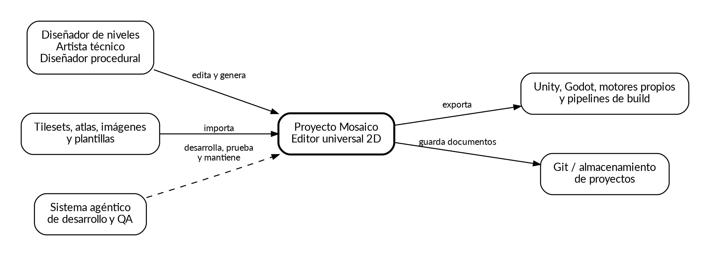
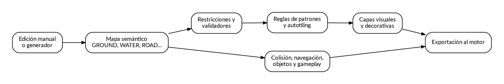
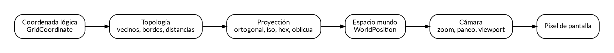
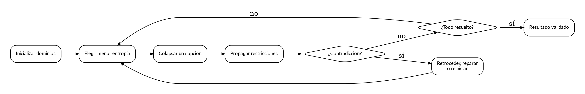
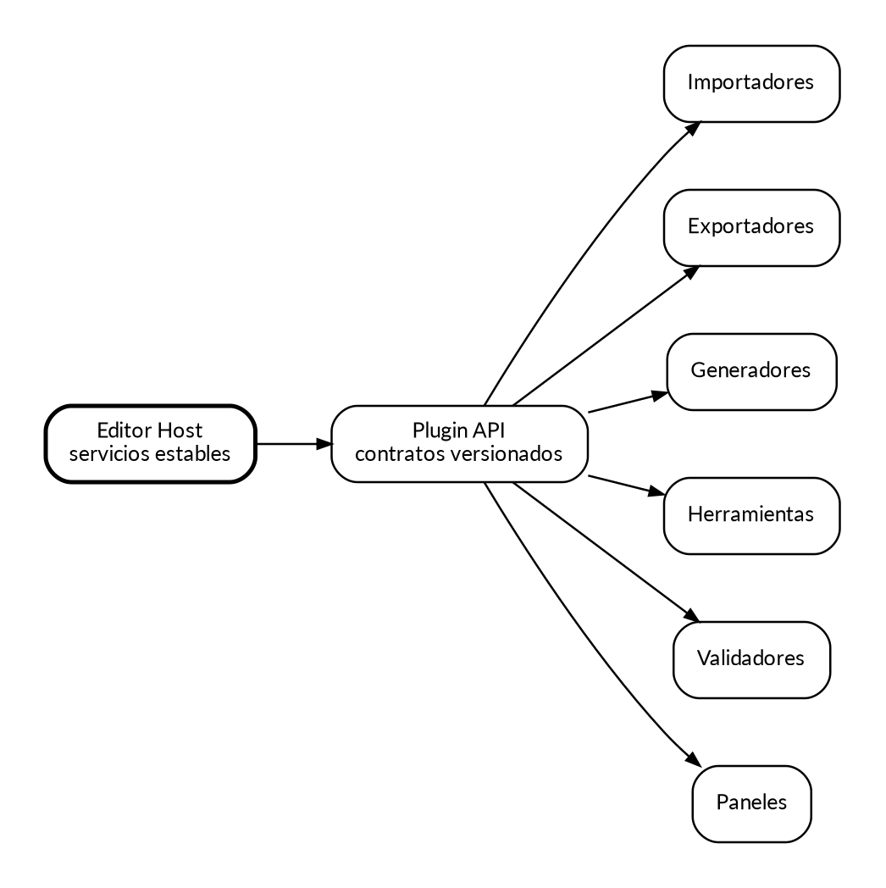
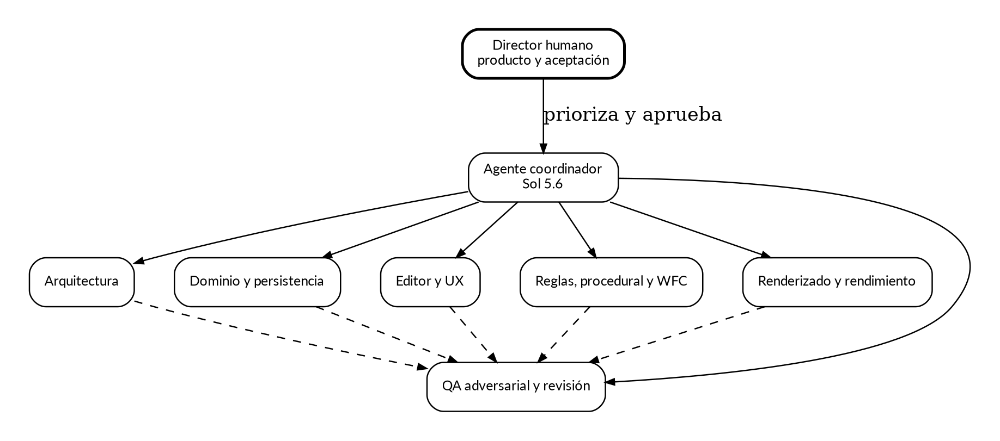

# Proyecto Mosaico — Dossier completo

> **Artefacto generado. No editar directamente.**
> Fuentes canónicas: `documentos/00_...md` a `documentos/14_...md`.
> Regenerar: `python tools/docs/build_dossier.py`.


---

> **Documento:** PM-00  
> **Versión:** 0.1.1 - Auditoría incorporada
> **Estado:** Auditado; no aprobado para implementación, con correcciones previas a Fase 0.
> **Nombre del producto:** Proyecto Mosaico es un nombre provisional.


# Propósito del dossier

Este paquete convierte la idea de un editor universal 2D en una base de ingeniería ejecutable. No es una promesa de que cada decisión sea definitiva. Es un conjunto coordinado de especificaciones que permite iniciar prototipos, repartir trabajo, evaluar resultados y registrar cambios sin perder coherencia.

El producto objetivo permite editar y generar niveles o mapas 2D en múltiples topologías: ortogonal, lateral sobre cuadrícula ortogonal, isométrica, escalonada, oblicua y hexagonal. Su rasgo diferencial es la separación entre intención semántica, representación visual y datos de juego, combinando edición manual, reglas de patrones, autotiling, generación procedural y Wave Function Collapse.



# Principios rectores

1. **Una cuadrícula no es una perspectiva.** La topología lógica y la proyección visual son contratos distintos.
2. **Un tile no es un terreno.** La celda semántica representa intención; el tile visual es una decisión derivada.
3. **El mapa visual no es el mapa jugable.** Colisiones, navegación y objetos deben sobrevivir a un cambio de arte.
4. **Todo resultado procedural debe ser editable.** El usuario puede bloquear, modificar, regenerar o convertir a contenido manual.
5. **Toda operación destructiva debe ser reversible.** Comandos, transacciones, undo/redo, backups y escritura atómica son capacidades del núcleo.
6. **La reproducibilidad es una función de producto.** Semillas, versiones de algoritmos y parámetros forman parte del documento.
7. **Los plugins amplían; no gobiernan el núcleo.** La API pública es menor que la implementación interna y se versiona explícitamente.
8. **La calidad se demuestra.** Compilación, pruebas, archivos dorados, benchmarks, regresión visual y sesiones de uso forman parte de la definición de terminado.

# Registro de documentos

| Código | Documento | Pregunta principal que responde |
|---|---|---|
| PM-00 | Índice maestro y gobernanza | ¿Qué documentos existen, cuál manda y cómo se cambian? |
| PM-01 | Visión de producto y alcance | ¿Qué producto se construye y para quién? |
| PM-02 | Especificación de requisitos | ¿Qué debe hacer y cómo sabremos que funciona? |
| PM-03 | Arquitectura de software | ¿Cómo se divide el sistema y qué dependencias se permiten? |
| PM-04 | Modelo espacial | ¿Cómo se representan topologías, proyecciones y coordenadas? |
| PM-05 | Modelo de datos y persistencia | ¿Qué se guarda, con qué identidad y cómo evoluciona? |
| PM-06 | UX del editor | ¿Cómo trabaja una persona con el producto? |
| PM-07 | Autotiling y motor de patrones | ¿Cómo se transforma intención local en presentación coherente? |
| PM-08 | Generación procedural | ¿Cómo se generan estructuras controlables y validables? |
| PM-09 | Motor WFC | ¿Cómo se resuelven posibilidades y restricciones locales? |
| PM-10 | Renderizado y rendimiento | ¿Cómo se mantiene el editor fluido en proyectos grandes? |
| PM-11 | Integraciones y plugins | ¿Cómo intercambia datos y cómo se amplía? |
| PM-12 | QA, seguridad y release | ¿Cómo se evita entregar datos corruptos o una herramienta frágil? |
| PM-13 | Desarrollo agéntico | ¿Cómo coordinar Sol 5.6 y agentes especializados con control humano? |
| PM-14 | Roadmap, backlog y plantillas | ¿En qué orden se construye y cómo se documentan decisiones? |

# Jerarquía y autoridad

En caso de contradicción se aplica el siguiente orden:

1. ADR aceptado con fecha posterior.
2. Requisito aprobado en PM-02.
3. Contrato de arquitectura en PM-03, PM-04 o PM-05.
4. Diseño especializado del subsistema correspondiente.
5. Roadmap y ejemplos, que son orientativos y pueden replanificarse.

Los ejemplos de pseudocódigo expresan intención y no constituyen una API congelada. Una API se considera estable solo cuando aparece en el registro de compatibilidad de plugins o en un ADR de estabilización.

# Control de cambios

Todo cambio relevante debe incluir:

- Problema o necesidad que lo origina.
- Documentos y requisitos afectados.
- Alternativas consideradas.
- Compatibilidad de archivos, plugins y proyectos existentes.
- Plan de migración y reversión.
- Evidencia: pruebas, benchmark, prototipo o sesión de usuario.
- Decisión y responsables.

Cambios locales y reversibles pueden entrar por pull request ordinario. Cambios que afecten el formato nativo, topologías, modelo de identidad, threading, sistema de plugins o semántica de reglas requieren un ADR.

## Estados documentales

| Estado | Significado | Autoridad necesaria para avanzar |
|---|---|---|
| Borrador | Hipótesis incompleta; puede contener alternativas y huecos conocidos. | Propietario temporal del documento. |
| Auditado | Revisado contra corpus y riesgos; los hallazgos están registrados, pero pueden quedar bloqueos. | Revisor independiente del dominio. |
| Aprobado | Suficiente para ejecutar la fase indicada; contratos, aceptación y decisiones límite están cerrados. | Responsables humanos definidos por gobernanza. |
| Estable | Validado por implementación, pruebas, migraciones y uso; cambios incompatibles exigen ADR. | Aprobación humana y evidencia de release. |
| Sustituido | Reemplazado por versión, ADR o documento posterior identificado. | Responsable del documento y enlace al reemplazo. |

`Auditado` no significa listo para implementar. Cada documento debe declarar fase objetivo, bloqueos y evidencia pendiente antes de pasar a `Aprobado`.

## Fuentes canónicas y artefactos generados

- Los quince capítulos `documentos/00_...md` a `documentos/14_...md` son fuentes canónicas y se editan por separado.
- `Proyecto_Mosaico_Dossier_Completo.md` es generado; no se edita directamente.
- Los archivos `diagramas/*.dot` son fuente de los PNG con el mismo nombre base. Los PNG se versionan para lectura sin Graphviz.
- `README.md` orienta navegación y comandos, pero no reemplaza contratos PM ni ADR.
- La auditoría bajo `analisis_documental/` registra evidencia y backlog; no cambia requisitos por sí sola.

El dossier se regenera con `python tools/docs/build_dossier.py`. `python tools/docs/build_dossier.py --check` debe fallar cuando el artefacto difiera de sus fuentes.

# Roles de gobernanza

| Rol | Responsabilidad |
|---|---|
| Director de producto | Prioriza necesidades, define usuarios y acepta experiencia de uso. |
| Arquitecto principal | Mantiene límites, contratos, ADR y deuda técnica. |
| Responsable de formato | Custodia esquema, migraciones y compatibilidad. |
| Responsable de algoritmos | Custodia reglas, generación procedural y WFC. |
| Responsable de UX | Mantiene flujos, accesibilidad y consistencia del editor. |
| QA principal | Define evidencia, prueba adversarial y puertas de release. |
| Seguridad | Revisa plugins, archivos no confiables, actualizaciones y distribución. |

Un agente puede desempeñar temporalmente un rol, pero la aceptación de producto y las decisiones irreversibles requieren aprobación humana explícita.

# Orden de lectura recomendado

Para dirección de producto: PM-01, PM-02, PM-06 y PM-14.

Para ingeniería del núcleo: PM-03, PM-04, PM-05 y PM-12.

Para algoritmos: PM-07, PM-08, PM-09 y PM-10.

Para construir el sistema agéntico: PM-13, seguido por los contratos de cada módulo.

# Decisiones que deben tomarse antes del primer sprint

- Lenguaje y framework de escritorio.
- Renderer 2D y política de abstracción gráfica.
- Alcance exacto del MVP: solo ortogonal o también isométrico temprano.
- Licencia del producto y estrategia de monetización.
- Formato de proyecto: contenedor único o carpeta con manifiesto.
- Soporte inicial de sistemas operativos.
- Nivel de compatibilidad con Tiled que se promete públicamente.
- Política de plugins: firmados, aislados, con permisos o solo locales de confianza.

# Definición documental de terminado

Un documento se considera listo para implementación cuando contiene propósito, límites, términos, contratos, errores esperables, criterios de aceptación, riesgos y decisiones abiertas. Se considera estable cuando los prototipos han validado sus supuestos principales y cualquier cambio incompatible exige migración documentada.


## Referencias técnicas de inspiración

Estas referencias se emplean para estudiar conceptos y formatos, no para copiar código, recursos gráficos ni interfaces:

- Tiled, documentación oficial: https://doc.mapeditor.org/
- Tiled, formato JSON: https://doc.mapeditor.org/en/stable/reference/json-map-format/
- Tiled, repositorio oficial: https://github.com/mapeditor/tiled
- TileKit, descripción oficial: https://rxi.itch.io/tilekit
- Unity 2D Tilemap y Rule Tile: https://docs.unity3d.com/6000.4/Documentation/Manual/tilemaps/tilemaps-landing.html
- Unity 2D Tilemap Extras: https://docs.unity3d.com/Packages/com.unity.2d.tilemap.extras@8.0/manual/RuleTile-introduction.html
- Wave Function Collapse, repositorio de referencia: https://github.com/mxgmn/WaveFunctionCollapse

Toda dependencia o reutilización de código deberá pasar por una revisión específica de licencia, atribución y compatibilidad con el modelo de distribución del producto.

---

> **Documento:** PM-01  
> **Versión:** 0.2.0 - Ola 1 incorporada
> **Estado:** Aprobado
> **Alcance de aprobación:** Fase 0 condicionada; Fase 1 permanece no aprobada.
> **Nombre del producto:** Proyecto Mosaico es un nombre provisional.


# Resumen ejecutivo

Proyecto Mosaico es un editor de mapas y niveles 2D independiente del motor. Permite que una persona combine cuatro maneras de trabajar en un mismo documento:

- Colocación manual precisa de tiles y objetos.
- Pintura semántica, donde se dibuja WATER, ROAD, WALL o PLATFORM sin escoger cada sprite.
- Transformación automática mediante reglas locales, patrones y terrenos.
- Generación procedural y WFC, con previsualización, bloqueo de regiones, validación y edición posterior.

El producto no intenta reproducir un editor pictórico de mapas. Las capas, máscaras, imágenes y paralaje existen para componer niveles, no para sustituir una aplicación de ilustración.



# Problema que resuelve

Los editores de tilemaps tradicionales son excelentes para colocar contenido, pero el trabajo repetitivo de bordes, esquinas, transiciones, variaciones y decoraciones consume tiempo y produce errores. Las herramientas procedurales, por otro lado, suelen generar resultados difíciles de corregir o desconectados del flujo manual. Mosaico une ambos mundos y conserva la autoría del diseñador.

La persona debe poder decir:

> Aquí hay agua, este corredor debe permanecer, completa el bosque, no cambies esta habitación, aplica el estilo de invierno y valida que el jugador pueda llegar a la salida.

El sistema traduce esa intención en capas visuales y de juego, explica qué reglas actuaron y permite revertir cada operación.

# Usuarios objetivo

## Diseñador de niveles 2D

Necesita construir niveles cenitales, plataformas, metroidvanias, tácticos hexagonales o escenarios isométricos. Valora herramientas predecibles, atajos, capas, objetos, colisiones, pruebas de navegación e integración con el motor.

## Artista técnico de tiles

Prepara tilesets, animaciones, colisiones, tags, Wang sets, conectores y reglas de patrones. Necesita depuración visual y reutilización de paquetes de reglas.

## Diseñador procedural

Crea generadores, restricciones y presets. Necesita semillas reproducibles, métricas, validadores, comparación de resultados y ejecución por lotes.

## Programador de herramientas o motor

Integra formatos, escribe plugins y exportadores, automatiza builds y valida contenido en CI.

## Equipo pequeño o creador independiente

Busca reducir tareas repetitivas sin construir un editor interno. Necesita instalación sencilla, documentación local y un camino gradual desde uso manual hasta automatización.

# Usuario primario F0-F1

La hipótesis primaria es un creador independiente o diseñador de niveles 2D con experiencia básica o intermedia en tilemaps, que trabaja solo o en un equipo de hasta cinco personas sobre escritorio Windows. Construye niveles ortogonales cenitales o laterales, usa teclado y mouse, y necesita editar, deshacer, guardar, reabrir y exportar sin programar plugins.

Reclutamiento para validación: al menos seis meses creando mapas 2D, un proyecto terminado o prototipo jugable, experiencia con Tiled, Unity Tilemap, Godot TileMap o equivalente y ninguna participación previa en el diseño de Mosaico. Cada ronda usa cinco participantes y registra experiencia y herramienta habitual.

Antiusuario F0-F1: equipo AAA que exige colaboración simultánea o pipeline propietario; artista que busca pintura raster/vectorial profesional; desarrollador cuyo objetivo principal es plugins o CI; usuario que exige isométrico, hexagonal, WFC o procedural avanzado desde el primer uso; y usuario móvil/tablet. Estos perfiles siguen siendo futuros o secundarios, pero no deciden el primer slice.

Problema verificable: construir y mantener niveles ortogonales obliga a repetir colocación y correcciones, mientras automatizaciones existentes suelen ser difíciles de corregir o revertir. La primera evidencia debe demostrar edición directa predecible y cero pérdida antes de medir automatización.

# Tareas de referencia

| ID | Tarea | Éxito | Requisitos | Fase |
|---|---|---|---|---|
| TR-01 | Crear mapa ortogonal 32×18, pintar, borrar, deshacer/rehacer, guardar, cerrar, reabrir y exportar | Estado semántico e IDs iguales; exportación válida; sin rescate | REQ-PROJ-001, REQ-MAP-004, REQ-EDIT-001/004, REQ-ASSET-001, REQ-IO-003, REQ-NFR-006 | Spike reducido F0; completo F1 |
| TR-02 | Pintar WATER, inspeccionar regla, modificar una celda y deshacer | Incremental igual a recálculo completo; usuario explica causa y reversión | REQ-MAP-005, REQ-EDIT-004, REQ-RULE-001/006/007 | Spike F0; entrega F3 |
| TR-03 | Previsualizar regeneración localizada con semilla y región bloqueada, cancelar, aceptar y deshacer | Cancelación no muta; semilla reproduce; bloqueos intactos | REQ-EDIT-004, REQ-PCG-003…006 | Spike F0; entrega F5 |

# Escenarios principales

## Nivel lateral

El usuario dibuja la ruta principal y plataformas obligatorias. Un validador usa parámetros de salto para detectar huecos imposibles. Las reglas añaden superficies, bordes, pendientes y fondos. Un generador propone rutas opcionales, pero respeta regiones bloqueadas.

## Mundo cenital

Se pintan terrenos semánticos y caminos. El motor de patrones resuelve costas, transiciones y decoraciones. Voronoi y ruido generan biomas; un grafo garantiza conexiones entre asentamientos.

## Táctico hexagonal

Cada hexágono conserva terreno, elevación, coste y cobertura. Las reglas visuales resuelven costas y carreteras en seis direcciones. El exportador produce datos de navegación y una representación compatible con el motor.

## Ciudad isométrica

El usuario fija calles y parcelas. Un generador coloca huellas de edificios. WFC completa módulos compatibles de fachadas y tejados. El orden de renderizado se deriva de anclas y profundidad, con correcciones manuales cuando sea necesario.

## Completion de una región

El usuario selecciona un área incompleta, bloquea el perímetro y pide a WFC que la complete. Puede explorar variantes con la misma estructura, aceptar una o restaurar el estado anterior.

# Propuesta de valor

1. **Universalidad estructural:** distintas vistas comparten un dominio y no son productos aislados.
2. **Intención separada del arte:** cambiar de tileset o estación no exige rehacer el diseño lógico.
3. **Procedural editable:** la generación produce comandos y procedencia, no una caja negra irreversible.
4. **Explicabilidad:** el inspector muestra regla, semilla, versión y causa de una decisión.
5. **Integración abierta:** formato documentado, CLI, plugins e importadores/exportadores desacoplados.
6. **Calidad de herramienta profesional:** recuperación, atomicidad, rendimiento, accesibilidad y pruebas visuales.

# Alcance funcional

El producto incluirá mapas finitos e infinitos, capas especializadas, tilesets, objetos, propiedades tipadas, animaciones, colisiones, navegación, topologías múltiples, reglas, generadores, WFC, importación, exportación, CLI y plugins.

El editor podrá contener imágenes libres y grupos con paralaje, pero no ofrecerá en las primeras versiones pintura raster avanzada, filtros fotográficos, pinceles artísticos complejos ni un catálogo comercial de stamps.

# Fuera de alcance inicial

- Motor de juego completo, física en tiempo real o scripting de gameplay general.
- Editor vectorial profesional.
- Colaboración simultánea multiusuario estilo documento en línea.
- Marketplace dentro de la aplicación.
- Generación de arte mediante modelos de imagen como requisito central.
- Compatibilidad perfecta con cada extensión privada de todos los motores.
- Sustitución total de Tiled desde la primera versión.

# Diferenciación frente a herramientas existentes

Mosaico no se define por tener más botones, sino por mantener un modelo semántico y procedural como parte nativa del documento. La compatibilidad con Tiled es una capacidad de intercambio; TileKit inspira la transformación por patrones; Rule Tile ilustra reglas vecinales; WFC aporta resolución de restricciones. La implementación debe ser propia, coherente y gobernada por los requisitos del producto.

# Métricas de éxito

## Métricas de tarea

- Tiempo para construir un área repetitiva frente a colocación manual.
- Número de correcciones manuales requeridas después de aplicar reglas.
- Porcentaje de operaciones que se pueden deshacer sin pérdida.
- Éxito de importación y exportación en proyectos de referencia.
- Tiempo de aprendizaje para completar un tutorial real.

## Métricas de calidad

- Cero pérdidas de datos en pruebas de fallo de proceso y energía simulada.
- Cero adyacencias inválidas en suites de autotiling y WFC.
- Presupuesto de interacción sostenido en mapas grandes de referencia.
- Tasa de archivos antiguos migrados correctamente.
- Cobertura de teclado de los flujos esenciales.

## Métricas de adopción

- Proyectos creados y exportados, no solo instalaciones.
- Reutilización de paquetes de reglas y presets.
- Número de formatos y motores mantenidos por plugins externos.
- Retención de usuarios que completan el primer mapa.

## Contratos métricos F0-F1

Toda ejecución registra ID, tipo, REQ, hipótesis, fixture y hash, unidad, método, muestra, entorno, baseline, objetivo, umbral de fallo, evidencia, acción posterior y dueño. Baseline desconocido nunca cuenta como éxito.

| ID | Tipo | Baseline | Objetivo | Muestra y método | Fallo |
|---|---|---|---|---|---|
| USER-TR01-001 | Usuario | Herramienta habitual, medido en ronda | ≥4/5 completan sin ayuda crítica; mediana ≤20 min y no peor que baseline | Cinco usuarios, Windows 11, fixture fijo, observación y cronómetro | Corregir flujo/onboarding y repetir |
| FUNC-RT-001 | Funcional | Corpus inicial | 100 % conserva hash semántico e IDs | Corpus canónico; comparación automática antes/después | Cualquier diferencia es S0 |
| FUNC-UNDO-001 | Funcional | Matriz inicial | 100 % restaura hash previo y redo final | Herramientas esenciales y secuencias deterministas | Divergencia es S0 |
| FUNC-SAVE-001 | Integridad | Sin baseline aceptable | Tras fallo existe versión anterior o nueva completa; cero mezclas | Fault injection en cada etapa | Spike rechazado |
| PERF-FRAME-001 | Benchmark | Se mide en F0 | Frame p95 ≤16,7 ms | Build Release, fixture y máquina publicados, 30 muestras | Optimizar o rechazar stack |
| PERF-BRUSH-001 | Benchmark | Se mide en F0 | Commit p95 <50 ms | Misma máquina/fixture, 30 muestras | Optimizar o reducir alcance con decisión |
| SEC-OPEN-001 | Seguridad | Cero actividad esperada | Cero procesos, red o escrituras fuera de roots al abrir | Fixture canario y observación de efectos | S0/S1, fase abierta |

Evidencia de usuario, evidencia funcional y benchmark se reportan por separado. S0/S1 no admite waiver; S2 exige dueño, justificación y caducidad.

# Estrategia de producto

La primera versión debe ser un editor ortogonal excelente y una demostración clara del mapa semántico. Isométrico y hexagonal se añaden cuando el contrato topológico ha sido probado. WFC aparece después de que el motor de reglas, el sistema de transacciones y los validadores sean confiables.

La prioridad no es acumular algoritmos. Es conseguir que una persona pueda alternar de forma natural entre pintar, generar, inspeccionar, corregir y exportar.

# Riesgos de producto

- Interfaz demasiado compleja por exponer todos los conceptos simultáneamente.
- Resultados procedurales técnicamente válidos pero artísticamente pobres.
- Expectativas irreales de compatibilidad con herramientas existentes.
- Convertir el sistema semántico en una obligación en vez de una ventaja opcional.
- Hacer que cada topología tenga un flujo distinto y fragmentar la experiencia.

La mitigación principal es una UX progresiva: modo básico para edición directa, modo de reglas para autores de tilesets y modo procedural para usuarios avanzados.

# Criterio de salida de la fase de descubrimiento

La visión se considera validada cuando una matriz `hipótesis → spike → evidencia → decisión` demuestra TR-01, TR-02 y TR-03; compara stack/renderer en viewport, input, HiDPI, accesibilidad, packaging y automatización; prueba atomicidad y chunks; registra ADR, formato experimental y presupuestos; y obtiene revisión humana de Producto/UX, Arquitectura, QA y Seguridad. Cada spike se marca descartable. F0 no promete formato estable, compatibilidad externa ni UI final. Cero S0/S1 puede permanecer abierto.


## Referencias técnicas de inspiración

Estas referencias se emplean para estudiar conceptos y formatos, no para copiar código, recursos gráficos ni interfaces:

- Tiled, documentación oficial: https://doc.mapeditor.org/
- Tiled, formato JSON: https://doc.mapeditor.org/en/stable/reference/json-map-format/
- Tiled, repositorio oficial: https://github.com/mapeditor/tiled
- TileKit, descripción oficial: https://rxi.itch.io/tilekit
- Unity 2D Tilemap y Rule Tile: https://docs.unity3d.com/6000.4/Documentation/Manual/tilemaps/tilemaps-landing.html
- Unity 2D Tilemap Extras: https://docs.unity3d.com/Packages/com.unity.2d.tilemap.extras@8.0/manual/RuleTile-introduction.html
- Wave Function Collapse, repositorio de referencia: https://github.com/mxgmn/WaveFunctionCollapse

Toda dependencia o reutilización de código deberá pasar por una revisión específica de licencia, atribución y compatibilidad con el modelo de distribución del producto.

---

> **Documento:** PM-02  
> **Versión:** 0.2.0 - Ola 1 incorporada
> **Estado:** Aprobado
> **Alcance de aprobación:** Fase 0 condicionada; Fase 1 permanece no aprobada.
> **Nombre del producto:** Proyecto Mosaico es un nombre provisional.


# Convenciones

Cada requisito posee un identificador permanente. El texto puede aclararse, pero el identificador no se reutiliza para una necesidad diferente. Los criterios indicados son mínimos; las historias y pruebas de cada sprint pueden añadir restricciones.

Prioridades sugeridas:

- **P0:** integridad de datos, contratos del núcleo y capacidades necesarias para cualquier uso.
- **P1:** MVP utilizable y diferenciación inicial.
- **P2:** ampliación de topologías, algoritmos e integraciones.
- **P3:** optimizaciones o flujos especializados.

# Requisitos del sistema

### Gestión de proyectos y documentos

| ID | Requisito | Criterio mínimo de aceptación |
|---|---|---|
| REQ-PROJ-001 | Crear, abrir, guardar y cerrar proyectos sin pérdida de datos | Una prueba round-trip conserva el documento completo y los identificadores estables. |
| REQ-PROJ-002 | Soportar varios mapas, tilesets y recursos dentro de un proyecto | El explorador muestra dependencias y permite abrir cada recurso. |
| REQ-PROJ-003 | Detectar modificaciones externas y ofrecer recarga o conservación local | La aplicación nunca sobrescribe silenciosamente cambios externos. |
| REQ-PROJ-004 | Mantener historial de migraciones de formato | Un archivo de versiones anteriores se actualiza mediante migraciones registradas. |
| REQ-PROJ-005 | Proveer guardado automático y recuperación tras fallo | Una sesión interrumpida puede restaurarse sin sustituir el último guardado confirmado. |

### Topologías, mapas y capas

| ID | Requisito | Criterio mínimo de aceptación |
|---|---|---|
| REQ-MAP-001 | Crear mapas ortogonales finitos e infinitos | Las coordenadas positivas y negativas funcionan mediante chunks. |
| REQ-MAP-002 | Crear mapas isométricos de diamante y escalonados | Selección, pintura y exportación mantienen correspondencia celda-mundo. |
| REQ-MAP-003 | Crear mapas hexagonales pointy-top y flat-top | Cada celda expone exactamente seis vecinos coherentes. |
| REQ-MAP-004 | Permitir perfiles de uso cenital y lateral sobre cuadrícula ortogonal | El perfil modifica ayudas, validadores y herramientas sin cambiar el almacenamiento base. |
| REQ-MAP-005 | Gestionar capas de tiles, objetos, imágenes, grupos, semántica, colisión y navegación | Cada tipo conserva propiedades comunes y datos especializados. |
| REQ-MAP-006 | Aplicar visibilidad, bloqueo, opacidad, offset, paralaje y orden | El viewport y la exportación respetan los valores. |
| REQ-MAP-007 | Soportar múltiples tilesets por mapa | Los identificadores permanecen estables al reordenar tilesets. |

### Edición interactiva

| ID | Requisito | Criterio mínimo de aceptación |
|---|---|---|
| REQ-EDIT-001 | Pintar, borrar, rellenar y dibujar formas | Cada herramienta produce una transacción única de undo. |
| REQ-EDIT-002 | Seleccionar, mover, copiar, pegar, rotar y reflejar regiones | La transformación preserva capas y referencias. |
| REQ-EDIT-003 | Editar objetos libres, polígonos, polilíneas, puntos y texto | Los vértices admiten snapping y edición numérica. |
| REQ-EDIT-004 | Disponer de undo/redo transaccional y persistente durante la sesión | Una secuencia aleatoria de acciones vuelve exactamente a los estados previos. |
| REQ-EDIT-005 | Ofrecer atajos configurables y comandos buscables | Todo comando relevante puede ejecutarse desde teclado y paleta. |
| REQ-EDIT-006 | Mostrar reglas, colisiones, navegación, chunks y semántica como overlays | Los overlays no alteran los datos y pueden combinarse. |

### Tilesets y assets

| ID | Requisito | Criterio mínimo de aceptación |
|---|---|---|
| REQ-ASSET-001 | Importar sprite sheets con tamaño, margen y separación | La región de cada tile coincide con los parámetros y no presenta bleeding. |
| REQ-ASSET-002 | Importar colecciones de imágenes individuales | Cada imagen genera una definición de tile estable. |
| REQ-ASSET-003 | Definir propiedades, tags, animaciones y colisiones por tile | Los datos se serializan y exportan. |
| REQ-ASSET-004 | Detectar recursos faltantes y permitir relocalización | Las referencias se reparan sin modificar IDs lógicos. |
| REQ-ASSET-005 | Generar miniaturas y cachés sin contaminar el proyecto | Los artefactos derivados pueden eliminarse y reconstruirse. |

### Autotiling y reglas

| ID | Requisito | Criterio mínimo de aceptación |
|---|---|---|
| REQ-RULE-001 | Soportar bitmasks de 4, 8 y 6 vecinos según topología | Los casos canónicos producen el tile esperado. |
| REQ-RULE-002 | Soportar Wang edges, corners y combinaciones | Las transiciones se resuelven y actualizan vecinos. |
| REQ-RULE-003 | Definir patrones de tamaño arbitrario con ancla | La coincidencia funciona en bordes y coordenadas negativas. |
| REQ-RULE-004 | Admitir EXACT, ANY, EMPTY, NOT, TAG, ONE_OF y SAME_AS | Cada condición posee pruebas positivas y negativas. |
| REQ-RULE-005 | Resolver conflictos por fase, prioridad, especificidad y peso | El resultado es determinista para una semilla fija. |
| REQ-RULE-006 | Actualizar solo la región afectada por una edición | El coste depende del radio máximo de regla, no del tamaño total del mapa. |
| REQ-RULE-007 | Registrar procedencia de contenido generado | El inspector identifica regla, ancla, revisión y semilla. |

### Generación procedural

| ID | Requisito | Criterio mínimo de aceptación |
|---|---|---|
| REQ-PCG-001 | Ejecutar generadores mediante una interfaz común | Cada generador declara parámetros, entrada, salida y validadores. |
| REQ-PCG-002 | Proveer BSP, random walk, cellular automata, laberintos, ruido, Voronoi y grafos | Cada algoritmo incluye preset y prueba reproducible. |
| REQ-PCG-003 | Usar semillas deterministas y flujos aleatorios separados | Cambiar decoración no altera necesariamente la estructura. |
| REQ-PCG-004 | Permitir previsualizar, aceptar, cancelar y regenerar una selección | Cancelar no modifica el documento. |
| REQ-PCG-005 | Bloquear regiones y preservar contenido manual | La regeneración local no toca celdas protegidas. |
| REQ-PCG-006 | Validar conectividad, densidad, accesibilidad y restricciones de conteo | Los fallos generan diagnóstico y acciones de reparación. |

### Wave Function Collapse

| ID | Requisito | Criterio mínimo de aceptación |
|---|---|---|
| REQ-WFC-001 | Implementar Simple Tiled Model con compatibilidad direccional | La salida no contiene adyacencias prohibidas. |
| REQ-WFC-002 | Implementar modelo Overlapping con extracción N por N | Los patrones, frecuencias y solapamientos se derivan de la muestra. |
| REQ-WFC-003 | Usar entropía ponderada y desempate reproducible | Una misma semilla reproduce decisiones. |
| REQ-WFC-004 | Propagar dominios mediante bitsets y soportes | Los benchmarks cumplen el presupuesto definido. |
| REQ-WFC-005 | Detectar contradicciones y ofrecer reinicio, backtracking y reparación local | El usuario ve causa y estrategia aplicada. |
| REQ-WFC-006 | Precolapsar celdas y completar mapas parciales | Las celdas bloqueadas nunca cambian. |
| REQ-WFC-007 | Visualizar entropía, dominios y cadena causal | El depurador explica por qué se eliminó una opción. |

### Importación, exportación y plugins

| ID | Requisito | Criterio mínimo de aceptación |
|---|---|---|
| REQ-IO-001 | Definir un formato nativo versionado y legible | El esquema dispone de documentación y migraciones. |
| REQ-IO-002 | Importar y exportar TMX/JSON de Tiled dentro del subconjunto declarado | Las diferencias no soportadas se reportan, no se descartan silenciosamente. |
| REQ-IO-003 | Exportar CSV e imágenes de previsualización | La orientación y el recorte son configurables. |
| REQ-IO-004 | Proveer adaptadores para Unity, Godot y motores propios | Los adaptadores no contaminan el dominio central. |
| REQ-IO-005 | Cargar plugins con manifiesto, permisos y compatibilidad de API | Un plugin incompatible se rechaza con diagnóstico. |
| REQ-IO-006 | Permitir plugins de herramientas, generadores, validadores, paneles e importadores | Cada extensión usa servicios públicos documentados. |

### Calidad, rendimiento y seguridad

| ID | Requisito | Criterio mínimo de aceptación |
|---|---|---|
| REQ-NFR-001 | Mantener interacción fluida a 60 FPS en operaciones comunes | El presupuesto se mide con proyectos de referencia. |
| REQ-NFR-002 | Abrir mapas grandes sin reservar matrices densas vacías | Los chunks y cachés limitan el uso de memoria. |
| REQ-NFR-003 | No bloquear la interfaz en generación, importación o validación larga | Las tareas son cancelables y reportan progreso. |
| REQ-NFR-004 | Ser resistente a archivos corruptos o maliciosos | Se aplican límites de tamaño, profundidad y recursos. |
| REQ-NFR-005 | Proteger recuperación, backups y escritura atómica | Un fallo durante guardado no destruye el archivo anterior. |
| REQ-NFR-006 | Ser accesible por teclado y compatible con escalado HiDPI | Los flujos esenciales no requieren mouse. |
| REQ-NFR-007 | Mantener telemetría opcional, mínima y transparente | El producto funciona sin telemetría y documenta cada dato. |

# Reglas transversales de aceptación

## Integridad

Ningún requisito se considera cumplido si la operación puede corromper el documento, perder identificadores, modificar contenido bloqueado o romper undo/redo. Las pruebas deben comparar el estado semántico completo, no únicamente una captura.

## Determinismo

Toda función que declare reproducibilidad debe registrar semilla, versión del algoritmo, parámetros normalizados y dependencias. El determinismo se limita a la misma plataforma y versión cuando existan diferencias justificadas de coma flotante; esas diferencias deben documentarse.

## Cancelación

Una tarea cancelable debe terminar en un punto consistente. No se acepta dejar la mitad de un resultado procedural aplicada ni un archivo parcialmente reemplazado.

## Diagnóstico

Cuando un formato, regla o plugin no pueda procesarse, el sistema debe indicar el recurso, la ubicación, la causa probable y una acción. Los errores silenciosos están prohibidos.

# Matriz de trazabilidad inicial

| Objetivo de producto | Grupos de requisitos |
|---|---|
| Edición universal 2D | REQ-MAP, REQ-EDIT, REQ-ASSET |
| Intención separada del arte | REQ-MAP-005, REQ-RULE, REQ-PCG |
| Procedural editable | REQ-PCG-003 a 006, REQ-WFC-005 a 007 |
| Interoperabilidad | REQ-IO |
| Herramienta profesional | REQ-PROJ, REQ-NFR |

La matriz bidireccional canónica se mantiene en `analisis_documental/02_matriz_trazabilidad.csv`. Debe contener exactamente los 56 REQ una vez, con prioridad aprobada, contrato, UX, prueba, fase, verificación y estado de cobertura. Una cobertura incompleta solo es válida como excepción justificada con hallazgo, fase límite y acción explícita. El validador falla ante requisitos o pruebas huérfanos, duplicados, prioridad provisional o campo obligatorio vacío.

## Política de prioridad aprobada

- **P0:** integridad, seguridad al abrir/guardar, identidad, formato base y recuperación. Bloquea fase y no admite degradación por alcance.
- **P1:** flujo esencial del editor, accesibilidad, rendimiento interactivo y operaciones necesarias para completar la tarea primaria.
- **P2:** capacidad avanzada o integración prevista que puede diferirse sin impedir TR-01.
- **P3:** optimización o extensión tardía cuyo aplazamiento no degrada contratos P0/P1.

La prioridad expresa riesgo y valor del producto, no orden de implementación aislado. Cambiarla requiere autoridad de Producto y revisión de QA/Arquitectura; un cambio P0 exige análisis de compatibilidad, migración y pruebas afectadas.

## Cadena de evidencia

Toda historia implementable enlaza `usuario → problema → tarea de referencia → REQ → contrato → implementación → prueba → evidencia → decisión`. Cada prueba y métrica enlaza de vuelta al menos un REQ. Historias de Fase 1 sin fixture, riesgo, aceptación verificable o gate manual no cumplen Definition of Ready.

# Casos de error obligatorios

Las pruebas de aceptación deben incluir archivos truncados, referencias rotas, tilesets enormes, coordenadas negativas, reglas sin solución, plugins incompatibles, falta de espacio en disco, cancelación durante guardado, cierre inesperado y pérdida temporal de un recurso externo.

# Criterios de no regresión

Cada bug de integridad, serialización, undo, geometría o compatibilidad debe producir una prueba automatizada. Cada bug visual reproducible debe añadir una escena dorada o una interacción automatizada.

# Gestión de requisitos

Un cambio de requisito debe especificar compatibilidad, migración, telemetría o evidencia de usuario que lo motiva y pruebas afectadas. Los requisitos P0 no pueden degradarse para acelerar una función P2 sin una decisión explícita.


## Referencias técnicas de inspiración

Estas referencias se emplean para estudiar conceptos y formatos, no para copiar código, recursos gráficos ni interfaces:

- Tiled, documentación oficial: https://doc.mapeditor.org/
- Tiled, formato JSON: https://doc.mapeditor.org/en/stable/reference/json-map-format/
- Tiled, repositorio oficial: https://github.com/mapeditor/tiled
- TileKit, descripción oficial: https://rxi.itch.io/tilekit
- Unity 2D Tilemap y Rule Tile: https://docs.unity3d.com/6000.4/Documentation/Manual/tilemaps/tilemaps-landing.html
- Unity 2D Tilemap Extras: https://docs.unity3d.com/Packages/com.unity.2d.tilemap.extras@8.0/manual/RuleTile-introduction.html
- Wave Function Collapse, repositorio de referencia: https://github.com/mxgmn/WaveFunctionCollapse

Toda dependencia o reutilización de código deberá pasar por una revisión específica de licencia, atribución y compatibilidad con el modelo de distribución del producto.

---

> **Documento:** PM-03  
> **Versión:** 0.1.1 - Auditoría incorporada
> **Estado:** Auditado; no aprobado para implementación, con correcciones previas a Fase 0.
> **Nombre del producto:** Proyecto Mosaico es un nombre provisional.


# Objetivos arquitectónicos

La arquitectura debe permitir probar algoritmos sin interfaz, cambiar el framework visual sin reescribir el dominio, añadir formatos sin contaminar el modelo interno y ejecutar operaciones largas de manera cancelable. También debe mantener una frontera clara entre datos autoritativos y cachés reconstruibles.


# Estilo general

Se propone una aplicación de escritorio modular con dominio rico, arquitectura por puertos y adaptadores y flujo de modificación basado en comandos. No se exige microservicios. La mayoría del producto funciona mejor como un proceso local con módulos internos y workers controlados.

## Capas

### Presentación

Ventanas, paneles, diálogos, accesibilidad, atajos, arrastrar y soltar y visualización de progreso. No debe contener reglas de serialización ni algoritmos de mapa.

### Aplicación

Casos de uso, comandos, transacciones, selección, documentos abiertos, jobs cancelables y coordinación entre servicios. Esta capa decide cuándo se modifica el documento.

### Dominio

Mapas, topologías, capas, celdas, objetos, propiedades, tilesets, identidad y invariantes. No depende del framework de UI, sistema operativo ni formato de archivo.

### Subsistemas especializados

Reglas, procedural, WFC y renderizado consumen contratos del dominio. Pueden tener estructuras optimizadas propias, pero no sustituyen al estado autoritativo.

### Infraestructura

Archivos, compresión, cachés, plugins, importadores, exportadores, logs, actualizaciones y adaptadores de motores.

# Regla de dependencias

Las dependencias apuntan hacia el dominio. Un importador conoce el formato externo y construye un documento interno. El dominio no conoce TMX, Unity ni el framework de ventanas.

Dependencias prohibidas:

- Dominio hacia UI.
- Dominio hacia importadores concretos.
- Generadores que escriben directamente en widgets.
- Plugins que acceden a campos internos no versionados.
- Renderer que modifica el documento durante el dibujo.

# Módulos propuestos

```text
Mosaico.Domain
Mosaico.Application
Mosaico.Editor
Mosaico.Rendering
Mosaico.Assets
Mosaico.Rules
Mosaico.Procedural
Mosaico.Wfc
Mosaico.Persistence
Mosaico.Formats.Native
Mosaico.Formats.Tiled
Mosaico.Export.Unity
Mosaico.Export.Godot
Mosaico.PluginApi
Mosaico.Cli
Mosaico.Diagnostics
```

Cada módulo público debe declarar propósito, dependencias permitidas, contratos estables y datos que posee.

# Documento y sesión

`ProjectDocument` representa datos persistentes. `EditorSession` contiene estado efímero: selección, herramienta activa, cámara, paneles, cachés y jobs. Guardar un proyecto no debe incluir posiciones de paneles salvo en un archivo de preferencias separado.

```csharp
public sealed class EditorSession
{
    public ProjectDocument Document { get; }
    public SelectionState Selection { get; }
    public CommandHistory History { get; }
    public JobRegistry Jobs { get; }
    public ViewportState Viewport { get; }
}
```

# Comandos y transacciones

Toda modificación autoritativa ocurre mediante un comando. Una pincelada comienza una transacción, acumula cambios y se confirma al soltar el puntero. Si la operación falla o se cancela, se revierte completa.

```csharp
public interface IEditorCommand
{
    string Description { get; }
    CommandResult Execute(DocumentContext context);
    void Undo(DocumentContext context);
}
```

Los comandos grandes no deben guardar una copia del proyecto. Conservan deltas por chunk, objetos afectados o estructuras persistentes con copy-on-write.

# Bus de eventos

Los eventos notifican cambios ya confirmados. No deben usarse para ocultar dependencias críticas. Ejemplos:

- `CellsChanged`
- `LayerStructureChanged`
- `TilesetReloaded`
- `ObjectChanged`
- `ProjectSaved`

Cada evento incluye región afectada y revisión. El renderer y los motores incrementales invalidan solo lo necesario.

# Jobs de larga duración

Importación, exportación, generación, WFC, validación global y construcción de thumbnails se ejecutan como jobs.

```csharp
public interface IBackgroundJob<T>
{
    Task<T> RunAsync(JobContext context, CancellationToken token);
}
```

Un job produce un resultado inmutable o un plan de cambios. La aplicación lo aplica en el hilo de documento dentro de una transacción. Esto evita que un worker modifique capas mientras la UI las lee.

# Servicios principales

- `DocumentService`: ciclo de vida, dirty state y guardado.
- `AssetService`: resolución, recarga y caché.
- `CommandService`: transacciones, undo y redo.
- `SelectionService`: selección multi-capa.
- `RuleEvaluationService`: coincidencia y salida incremental.
- `GenerationService`: ejecución de generadores.
- `ValidationService`: validadores y quick fixes.
- `ImportExportService`: adaptadores y reportes de pérdida.
- `PluginHost`: descubrimiento, permisos y aislamiento.
- `DiagnosticsService`: logs estructurados, métricas y bundles de soporte.

# Inyección de dependencias

La composición ocurre en el host de la aplicación. Los módulos de dominio aceptan interfaces pequeñas. Se evita un service locator global porque dificulta pruebas y plugins seguros.

# Estado autoritativo y derivados

Autoritativos:

- Documento, identificadores, propiedades y procedencia aceptada.
- Historial de migraciones.
- Paquetes de reglas incorporados al proyecto.

Derivados reconstruibles:

- Mallas de render.
- Miniaturas.
- Índices espaciales.
- Caché de coincidencias.
- Dominios WFC temporales.
- Previews procedurales no aceptados.

Los derivados nunca son la única copia de información del usuario.

# Concurrencia

El documento utiliza un modelo de escritor único. Lecturas pesadas trabajan sobre snapshots inmutables o revisiones. Al aplicar un resultado se comprueba que la revisión base no cambió; de lo contrario se reevalúa, fusiona explícitamente o solicita decisión.

# Manejo de errores

Los errores se clasifican en validación del usuario, incompatibilidad, fallo recuperable, fallo de integridad y fallo interno. Un fallo de integridad debe detener la operación, conservar evidencia y ofrecer recuperación, no continuar en estado dudoso.

# Estrategia tecnológica

Una opción razonable es C# con UI multiplataforma y un renderer 2D acelerado, por su ecosistema, tooling, integración con Unity y facilidad para bibliotecas de dominio. Rust con UI nativa o TypeScript con shell de escritorio también son viables, pero la decisión debe basarse en prototipos de viewport, input, HiDPI, packaging y perfilado.

El ADR inicial debe comparar al menos: tiempo de arranque, consumo, soporte de GPU, accesibilidad, automatización de UI, interoperabilidad nativa, depuración y estabilidad del framework.

# Calidad arquitectónica

Cada módulo debe tener pruebas de contrato. Se ejecutará una prueba de dependencias que impida referencias prohibidas. Los tipos persistentes no se exponen directamente a plugins; se usan DTO o interfaces versionadas.

# Decisiones abiertas

- Framework de UI y renderer.
- Uso de ECS para objetos: no recomendado en el editor salvo evidencia.
- Modelo de scripting de plugins: .NET, JavaScript, Lua o proceso externo.
- Persistencia del historial entre sesiones.
- Estrategia de aislamiento de plugins.


## Referencias técnicas de inspiración

Estas referencias se emplean para estudiar conceptos y formatos, no para copiar código, recursos gráficos ni interfaces:

- Tiled, documentación oficial: https://doc.mapeditor.org/
- Tiled, formato JSON: https://doc.mapeditor.org/en/stable/reference/json-map-format/
- Tiled, repositorio oficial: https://github.com/mapeditor/tiled
- TileKit, descripción oficial: https://rxi.itch.io/tilekit
- Unity 2D Tilemap y Rule Tile: https://docs.unity3d.com/6000.4/Documentation/Manual/tilemaps/tilemaps-landing.html
- Unity 2D Tilemap Extras: https://docs.unity3d.com/Packages/com.unity.2d.tilemap.extras@8.0/manual/RuleTile-introduction.html
- Wave Function Collapse, repositorio de referencia: https://github.com/mxgmn/WaveFunctionCollapse

Toda dependencia o reutilización de código deberá pasar por una revisión específica de licencia, atribución y compatibilidad con el modelo de distribución del producto.

---

> **Documento:** PM-04  
> **Versión:** 0.1.1 - Auditoría incorporada
> **Estado:** Auditado; no aprobado para implementación, con correcciones previas a Fase 0.
> **Nombre del producto:** Proyecto Mosaico es un nombre provisional.


# Principio central

El sistema no codifica "top-down", "plataformas" o "isométrico" como matrices incompatibles. Define topologías lógicas y proyecciones visuales. Los perfiles de juego añaden semántica y validadores, pero no cambian la identidad de una celda.



# Tipos fundamentales

```csharp
public readonly record struct GridCoordinate(int A, int B, int C = 0);
public readonly record struct WorldPosition(double X, double Y);
public readonly record struct ScreenPosition(double X, double Y);
public readonly record struct GridDirection(string Id, int Index);
```

`GridCoordinate` no debe interpretarse directamente como píxeles. En hexagonal puede contener axial `q,r`; en mapas con elevación, `C` puede representar nivel lógico y no profundidad visual.

# Contrato de topología

```csharp
public interface IGridTopology
{
    IReadOnlyList<GridDirection> Directions { get; }
    GridCoordinate Neighbor(GridCoordinate cell, GridDirection direction);
    int Distance(GridCoordinate a, GridCoordinate b);
    IEnumerable<GridCoordinate> Ring(GridCoordinate center, int radius);
    IEnumerable<GridCoordinate> CellsIntersecting(GridShape shape);
    IReadOnlyList<GridEdge> Edges(GridCoordinate cell);
}
```

La topología responde relaciones discretas. La proyección responde geometría visual.

# Contrato de proyección

```csharp
public interface IGridProjection
{
    WorldPosition CellOrigin(GridCoordinate cell);
    GridHit WorldToCell(WorldPosition position);
    Polygon2D CellPolygon(GridCoordinate cell);
    RectD Bounds(IEnumerable<GridCoordinate> cells);
}
```

`GridHit` incluye celda candidata, coordenada local, distancia al centro y borde más cercano. Esto mejora pintura y selección en celdas no rectangulares.

# Cuadrícula ortogonal

Transformación base:

```text
worldX = column * tileWidth
worldY = row * tileHeight
```

Vecindad cardinal de cuatro direcciones y opcional diagonal de ocho. El perfil lateral usa la misma topología, pero añade gravedad, plataformas unidireccionales, pendientes y conceptos como "superficie expuesta".

# Isométrico de diamante

Una proyección típica:

```text
worldX = (column - row) * tileWidth / 2
worldY = (column + row) * tileHeight / 2
```

La inversa produce valores fraccionarios y debe resolver el polígono real de la celda. Redondear sin prueba geométrica causa selección incorrecta cerca de bordes.

El orden visual no debe confundirse con el orden lógico. Los objetos altos usan un punto de apoyo o baseline. El renderer ordena por clave de profundidad y permite override explícito.

# Isométrico escalonado y oblicuo

Las variantes escalonadas desplazan filas o columnas pares/impares. El documento guarda orientación del stagger, índice par o impar y dimensiones. La proyección oblicua aplica una transformación afín, pero las herramientas siguen operando en coordenadas lógicas.

# Hexagonal

Se recomienda representación axial para algoritmos:

```text
(q, r)
```

Con coordenada cúbica derivada:

```text
x = q
y = -q-r
z = r
x + y + z = 0
```

La distancia:

```text
max(abs(dx), abs(dy), abs(dz))
```

Debe soportarse pointy-top y flat-top. Los offsets odd-r, even-r, odd-q y even-q son formatos de interoperabilidad, no el dominio interno preferido.

# Coordenadas negativas y chunks

Se usa floor division, no truncamiento hacia cero:

```text
chunkA = floorDiv(cellA, chunkWidth)
localA = floorMod(cellA, chunkWidth)
```

La propiedad `0 <= localA < chunkWidth` debe cumplirse también para valores negativos.

# Capas con distinto espacio

Una capa puede estar ligada a la cuadrícula, al mundo o a la pantalla:

- Tile layer: coordenadas de celda.
- Object layer: espacio mundo continuo.
- Image layer: espacio mundo con repetición opcional.
- Overlay de UI: espacio pantalla.

Los offsets y paralaje se aplican después de la proyección del contenido.

# Selección y picking

La selección rectangular en pantalla no siempre es rectangular en la grilla. El sistema transforma el polígono de selección a mundo y solicita a la topología las celdas intersectadas. Para pinceles, se usa el centro o una regla configurable de cobertura.

El picking de objetos emplea un índice espacial y respeta orden visual, bloqueo de capa, transparencia opcional y tolerancia de pantalla independiente del zoom.

# Formas y regiones

Se definen formas lógicas reutilizables:

- Celda, borde y vértice.
- Rectángulo de celdas.
- Anillo y disco topológico.
- Línea discreta.
- Polígono en espacio mundo.
- Máscara arbitraria de celdas.

Los generadores y reglas trabajan con estas abstracciones en lugar de bucles específicos por topología.

# Orden de renderizado

Cada instancia produce una clave:

```text
(layerOrder, depthBand, depthKey, manualBias, stableId)
```

`stableId` elimina parpadeos cuando dos elementos tienen la misma profundidad. Los mapas laterales suelen usar orden de capa; isométrico puede usar baseline Y y nivel; hexagonal puede usar fila proyectada.

# Elevación y múltiples niveles

La elevación es un atributo separado de la coordenada de capa. Puede afectar proyección, sombra, navegación y compatibilidad de bordes. No debe codificarse exclusivamente moviendo el sprite, porque el gameplay necesita conocerla.

# Invariantes y pruebas

- `WorldToCell(CellOrigin(c)+centerOffset)` devuelve `c`.
- Vecindad es recíproca donde la topología lo declare.
- La distancia es cero solo para la misma celda.
- Ring de radio `n` no contiene duplicados.
- Conversión de chunk funciona con extremos negativos.
- Selección visual en zoom alto y bajo devuelve las mismas celdas lógicas.

# Extensión futura

Una API de topología permite triángulos, grids irregulares o grafos de nodos. Sin embargo, el MVP no debe generalizar más de lo necesario. Ortogonal e isométrico comparten mucha infraestructura; hexagonal valida que el contrato no dependa de cuatro vecinos.


## Referencias técnicas de inspiración

Estas referencias se emplean para estudiar conceptos y formatos, no para copiar código, recursos gráficos ni interfaces:

- Tiled, documentación oficial: https://doc.mapeditor.org/
- Tiled, formato JSON: https://doc.mapeditor.org/en/stable/reference/json-map-format/
- Tiled, repositorio oficial: https://github.com/mapeditor/tiled
- TileKit, descripción oficial: https://rxi.itch.io/tilekit
- Unity 2D Tilemap y Rule Tile: https://docs.unity3d.com/6000.4/Documentation/Manual/tilemaps/tilemaps-landing.html
- Unity 2D Tilemap Extras: https://docs.unity3d.com/Packages/com.unity.2d.tilemap.extras@8.0/manual/RuleTile-introduction.html
- Wave Function Collapse, repositorio de referencia: https://github.com/mxgmn/WaveFunctionCollapse

Toda dependencia o reutilización de código deberá pasar por una revisión específica de licencia, atribución y compatibilidad con el modelo de distribución del producto.

---

> **Documento:** PM-05  
> **Versión:** 0.1.1 - Auditoría incorporada
> **Estado:** Auditado; no aprobado para implementación, con correcciones previas a Fase 0.
> **Nombre del producto:** Proyecto Mosaico es un nombre provisional.


# Objetivos

El formato debe preservar intención, permitir diffs razonables, soportar proyectos grandes y evolucionar sin destruir contenido. La serialización no debe exponer todas las decisiones internas ni depender del orden accidental de colecciones.

# Agregados principales

```text
Project
├── ProjectManifest
├── Maps[]
├── Tilesets[]
├── RulePackages[]
├── GeneratorPresets[]
├── Scripts[]
└── ExternalResources[]
```

Cada mapa contiene configuración espacial, capas, propiedades, referencias a recursos y metadatos de generación aceptada.

# Identidad

Se usan identificadores estables de 128 bits o equivalente. Un ID no cambia al renombrar, mover, reordenar o exportar. Los IDs numéricos compactos pueden existir en cachés o formatos externos, pero no son identidad autoritativa.

Tipos con identidad propia:

- Proyecto, mapa, tileset y tile.
- Capa y objeto.
- Paquete y regla.
- Preset de generador.
- Clase de propiedad.

Las celdas se identifican por mapa, capa y coordenada; no necesitan UUID individual salvo contenido generado con procedencia compleja.

# Modelo de mapa

```csharp
public sealed record MapDocument(
    MapId Id,
    SpatialConfiguration Spatial,
    ImmutableArray<LayerNode> Layers,
    ImmutableArray<TilesetBinding> Tilesets,
    PropertyBag Properties,
    GenerationMetadata Generation);
```

`SpatialConfiguration` referencia topología, proyección, tamaño de tile, chunk y parámetros de stagger o hex.

# Capas

Una jerarquía usa `LayerNode` con propiedades comunes:

```text
name, visible, locked, opacity, blendMode,
offset, parallax, tint, tags, properties
```

Subtipos:

- `TileLayer`: chunks de celdas visuales.
- `SemanticLayer`: valores de vocabulario o tags.
- `ObjectLayer`: entidades y geometría libre.
- `ImageLayer`: recurso, repetición y transformación.
- `CollisionLayer`: shapes o materialización derivada.
- `NavigationLayer`: costes, bloqueos y conectividad.
- `GroupLayer`: hijos ordenados.
- `GeneratedLayer`: salida derivada con política de edición.

# Celdas y referencias a tiles

Una celda visual contiene una referencia a tile y flags de transformación. Se evita acoplar el ID del tile a su posición en una textura.

```csharp
public readonly record struct TileInstance(
    TileId Tile,
    TileTransform Transform,
    VariantSeed Variant,
    GenerationStamp? GeneratedBy);
```

`VariantSeed` permite que una regla conserve una variante aleatoria mientras no cambie su contexto.

# Chunks

Los chunks son unidades de almacenamiento, invalidación y streaming. El tamaño es configurable por mapa dentro de límites. Una capa vacía no materializa chunks.

Cada chunk guarda revisión y codificación. Puede comprimirse por run-length, paleta local o compresión general. La elección es detalle de formato y debe medirse con corpus reales.

# Objetos

Un objeto contiene transformación, shape, clase, propiedades y posible referencia a tile o prefab.

Shapes mínimas:

- Punto.
- Rectángulo y rectángulo rotado.
- Elipse.
- Polígono.
- Polilínea.
- Texto.
- Tile object.

Las referencias entre objetos usan IDs y se validan al cargar.

# Propiedades tipadas

Tipos base:

```text
bool, int64, double, string, color, enum,
fileRef, assetRef, objectRef, classInstance, array
```

Las clases de propiedad definen campos, valores por defecto, restricciones y documentación. Una propiedad desconocida se conserva durante round-trip para compatibilidad hacia delante.

# Tilesets

Un tileset guarda fuente visual, regiones, anclas, colisiones, animaciones, tags, pesos y metadatos de terreno. Los recursos de imagen se referencian mediante URI de proyecto o asset ID, con ruta relativa como pista reparable.

# Reglas y procedencia

Una salida generada registra:

```text
packageId, ruleId, ruleRevision,
anchor, seed, generationPass, sourceRevision
```

La procedencia puede almacenarse por grupo o región para no inflar cada celda. El diseño debe equilibrar depuración y tamaño.

# Formato nativo

Se recomienda un proyecto como carpeta:

```text
project.mosaic.json
maps/
tilesets/
rules/
presets/
assets/
.cache/        # no versionar
.autosave/     # no versionar
```

Los archivos de mapa pueden usar JSON legible para metadatos y bloques binarios o comprimidos para chunks grandes. El manifiesto declara versión y hashes opcionales.

# Ejemplo simplificado

```json
{
  "format": "mosaico-project",
  "version": "1.0",
  "projectId": "...",
  "maps": ["maps/forest.mosaic-map.json"],
  "tilesets": ["tilesets/forest.mosaic-tileset.json"],
  "rulePackages": ["rules/forest-rules.json"]
}
```

Los números de versión de esquema son distintos de la versión de la aplicación.

# Escritura atómica

El guardado sigue:

1. Serializar a archivos temporales en el mismo volumen.
2. Validar estructura y, cuando proceda, volver a leer.
3. Sincronizar buffers.
4. Reemplazar mediante rename atómico.
5. Conservar backup rotativo.
6. Actualizar dirty state solo después de éxito.

Para proyectos multifichero se usa journal de transacción o un manifiesto de generación que permita detectar guardados incompletos.

# Autosave y recuperación

Autosave guarda deltas o snapshots en ubicación separada y nunca reemplaza el guardado manual. Al iniciar, se compara revisión y se ofrece recuperación con vista de diferencias. Los autosaves antiguos se purgan por política de espacio.

# Migraciones

Cada migración es idempotente cuando sea posible, está versionada y produce un informe. Antes de migrar se conserva una copia. Se prueban cadenas completas, no solo migraciones adyacentes.

```csharp
public interface IProjectMigration
{
    SchemaVersion From { get; }
    SchemaVersion To { get; }
    MigrationReport Apply(MigrationContext context);
}
```

# Diffs y control de versiones

Se mantiene orden estable y serialización canónica. Los chunks pueden almacenarse en archivos independientes para evitar conflictos masivos. Se ofrece un diff semántico capaz de explicar celdas, objetos, propiedades y reglas, no solo líneas JSON.

# Validación de carga

Límites obligatorios:

- Profundidad de JSON y tamaño de strings.
- Número máximo configurable de capas, objetos y patrones.
- Dimensiones y memoria estimada de imágenes.
- Coordenadas y tamaños numéricos válidos.
- Rechazo de rutas que escapen del proyecto.
- Descompresión con límites para evitar bombas.

# Compatibilidad externa

Importar Tiled significa mapear un subconjunto documentado y preservar extensiones desconocidas cuando sea viable. La exportación debe producir un reporte de conversiones, aproximaciones y pérdidas. Nunca se prometerá round-trip perfecto sin una suite de corpus que lo demuestre.

# Pruebas esenciales

- Round-trip canónico.
- Fuzzing de parsers.
- Archivos truncados en cada byte crítico.
- Fallo de disco durante cada fase de guardado.
- Migración desde todas las versiones soportadas.
- Proyecto movido de carpeta.
- Recursos ausentes y relocalizados.
- IDs duplicados y referencias circulares.


## Referencias técnicas de inspiración

Estas referencias se emplean para estudiar conceptos y formatos, no para copiar código, recursos gráficos ni interfaces:

- Tiled, documentación oficial: https://doc.mapeditor.org/
- Tiled, formato JSON: https://doc.mapeditor.org/en/stable/reference/json-map-format/
- Tiled, repositorio oficial: https://github.com/mapeditor/tiled
- TileKit, descripción oficial: https://rxi.itch.io/tilekit
- Unity 2D Tilemap y Rule Tile: https://docs.unity3d.com/6000.4/Documentation/Manual/tilemaps/tilemaps-landing.html
- Unity 2D Tilemap Extras: https://docs.unity3d.com/Packages/com.unity.2d.tilemap.extras@8.0/manual/RuleTile-introduction.html
- Wave Function Collapse, repositorio de referencia: https://github.com/mxgmn/WaveFunctionCollapse

Toda dependencia o reutilización de código deberá pasar por una revisión específica de licencia, atribución y compatibilidad con el modelo de distribución del producto.

---

> **Documento:** PM-06  
> **Versión:** 0.1.1 - Auditoría incorporada
> **Estado:** Auditado; no aprobado para implementación, con correcciones previas a Fase 0.
> **Nombre del producto:** Proyecto Mosaico es un nombre provisional.


# Objetivo de experiencia

La herramienta debe sentirse como un editor directo, no como un formulario para configurar algoritmos. El usuario ve el resultado inmediatamente y puede profundizar en semántica, reglas o procedural cuando lo necesita.

# Modelo mental

El documento contiene capas. El usuario elige qué representa la capa activa, selecciona una herramienta y realiza una acción reversible. Las automatizaciones aparecen como asistentes que producen previews o como reglas vinculadas a capas; no como procesos ocultos.

# Disposición base

```text
+--------------------------------------------------------------+
| Menú | comando | herramienta | modo | zoom | ejecutar         |
+---------------+-------------------------------+--------------+
| Proyecto      |                               | Capas        |
| Assets        |           Viewport            | Propiedades  |
| Tilesets      |                               | Reglas       |
| Presets       |                               | Validación   |
+---------------+-------------------------------+--------------+
| Estado: celda, mundo, selección, job, warnings               |
+--------------------------------------------------------------+
```

Todos los paneles son acoplables y restablecibles. Se ofrecen workspaces: Edición, Tileset, Reglas, Procedural, WFC y Depuración.

# Modos de complejidad

## Básico

Tiles, capas, objetos, pincel, selección, guardar y exportar. La semántica es opcional.

## Reglas

Expone terreno, tags, patrones, fases, procedencia y depuración.

## Procedural

Expone generadores, semillas, máscaras, restricciones, métricas y comparación de variantes.

El cambio de modo reorganiza herramientas; no cambia el documento ni oculta contenido de forma irreversible.

# Herramientas esenciales

## Pincel

Soporta un tile, stamp multi-celda, patrón aleatorio y pintura semántica. La vista previa muestra exactamente las celdas afectadas y el resultado de reglas cuando sea barato.

## Borrador

Distingue borrar contenido manual, borrar salida generada y limpiar valor semántico. Las diferencias deben ser visibles para evitar resultados inesperados.

## Relleno

Ofrece conectividad según topología, límite por capa, tolerancia y preview para áreas grandes. Puede cancelar antes de aplicar.

## Selección

Selecciona celdas y objetos, con filtros por capa o tipo. Mover una selección multi-capa crea una transacción. El pegado permite mapear tilesets faltantes.

## Formas

Rectángulo, elipse, línea, polígono y formas topológicas como anillo hexagonal. En mapas laterales puede incluir plataforma y pendiente.

## Objetos

Inserción, transformación, edición de vértices, conexiones y edición numérica. Los handles mantienen tamaño visual independiente del zoom.

# Flujo de tileset

1. Importar imagen o colección.
2. Configurar regiones y anclas.
3. Nombrar, etiquetar y agrupar tiles.
4. Definir colisiones y animaciones.
5. Configurar Wang, conectores o reglas.
6. Ejecutar diagnósticos de tiles faltantes y casos no cubiertos.
7. Publicar como paquete reutilizable.

# Flujo semántico

El usuario crea un vocabulario: GROUND, WATER, WALL, ROAD. Puede asignar iconos o colores de depuración. Una capa semántica alimenta reglas que escriben en capas visuales, colisión y navegación.

El inspector de una celda muestra:

- Valor semántico.
- Tiles visuales resultantes por capa.
- Regla ganadora y alternativas rechazadas.
- Dependencias vecinales.
- Procedencia y semilla.
- Quick fix para congelar el resultado como manual.

# Flujo procedural

1. Seleccionar mapa o región.
2. Elegir generador y preset.
3. Definir máscaras: editable, bloqueada, requerida, prohibida.
4. Ejecutar preview en snapshot.
5. Comparar variantes y métricas.
6. Aceptar como una sola transacción o cancelar.
7. Inspeccionar y corregir.

El preview debe permitir antes/después, overlay semántico y navegación. Las variantes no aceptadas no ensucian el historial.

# Flujo WFC

El usuario escoge modelo, conjunto de patrones, región y restricciones. Durante la ejecución ve progreso y puede pausar para inspección en modo de desarrollo. En uso normal solo ve variantes y diagnósticos claros.

Una contradicción se presenta como:

```text
No existe una pieza compatible en (42, -7).
Causa mínima conocida: borde ROAD_EAST exigido por la celda vecina,
pero la región bloqueada obliga WATER_WEST.
Acciones: retroceder, desbloquear, relajar regla o cancelar.
```

# Validación integrada

Los resultados aparecen en un panel agrupado por severidad y ubicación. Al activar un problema, el viewport enfoca la zona y resalta evidencia. Los quick fixes son comandos reversibles.

# Prevención de errores

- Capas bloqueadas rechazan edición con feedback visual.
- Acciones que reemplazan mucho contenido muestran alcance.
- Exportación con pérdida exige confirmación informada.
- Regenerar una región muestra qué contenido manual sería afectado.
- El sistema no cambia automáticamente el tileset activo por un click accidental en el mapa.

# Accesibilidad

- Navegación completa por teclado.
- Paleta de comandos con búsqueda tolerante.
- Foco visible y orden lógico.
- Escalado HiDPI y tamaños configurables.
- Iconos acompañados de texto o tooltip.
- Overlays con patrones, no solo color.
- Personalización de contraste y velocidad de animación.
- Lectura accesible de propiedades y errores.

# Atajos y comandos

Los comandos tienen ID estable, etiqueta, categoría, contexto y atajo configurable. Los conflictos se detectan. Un comando puede ejecutarse desde menú, toolbar, paleta, macro o plugin sin duplicar lógica.

# Onboarding

El primer inicio ofrece proyectos de ejemplo, no un recorrido modal interminable. Tutoriales activos:

- Crear un mapa ortogonal y exportarlo.
- Convertir una capa semántica en costas automáticas.
- Generar una cueva y reparar conectividad.
- Completar una región con WFC.

# Pruebas de UX

Las tareas de referencia se observan con usuarios y se miden por tiempo, errores, deshacer, preguntas y capacidad de explicar el resultado. La regresión visual no sustituye pruebas de uso.

# Criterio de calidad

Una capacidad avanzada no está terminada si solo puede operarla quien leyó el código. Debe tener vocabulario comprensible, preview, cancelación, diagnóstico y una ruta de aprendizaje.


## Referencias técnicas de inspiración

Estas referencias se emplean para estudiar conceptos y formatos, no para copiar código, recursos gráficos ni interfaces:

- Tiled, documentación oficial: https://doc.mapeditor.org/
- Tiled, formato JSON: https://doc.mapeditor.org/en/stable/reference/json-map-format/
- Tiled, repositorio oficial: https://github.com/mapeditor/tiled
- TileKit, descripción oficial: https://rxi.itch.io/tilekit
- Unity 2D Tilemap y Rule Tile: https://docs.unity3d.com/6000.4/Documentation/Manual/tilemaps/tilemaps-landing.html
- Unity 2D Tilemap Extras: https://docs.unity3d.com/Packages/com.unity.2d.tilemap.extras@8.0/manual/RuleTile-introduction.html
- Wave Function Collapse, repositorio de referencia: https://github.com/mxgmn/WaveFunctionCollapse

Toda dependencia o reutilización de código deberá pasar por una revisión específica de licencia, atribución y compatibilidad con el modelo de distribución del producto.

---

> **Documento:** PM-07  
> **Versión:** 0.1.1 - Auditoría incorporada
> **Estado:** Auditado; no aprobado para implementación, con correcciones previas a Fase 0.
> **Nombre del producto:** Proyecto Mosaico es un nombre provisional.


# Objetivo

Transformar un mapa de intención o un contexto vecinal en capas visuales y de juego coherentes. El motor debe cubrir casos sencillos con bitmasks y casos complejos con patrones arbitrarios, sin convertir cada pincelada en un recálculo global.

# Niveles de capacidad

1. Bitmask por direcciones.
2. Terrenos Wang por bordes y esquinas.
3. Reglas declarativas de patrones.
4. Pasadas encadenadas y salidas multi-capa.
5. Validadores de cobertura y conflictos.

# Bitmasks

Una topología expone direcciones ordenadas. La máscara activa un bit cuando la condición de vecino se cumple. Ortogonal cardinal usa 4 bits; ortogonal completo, 8; hexagonal, 6.

```csharp
ulong ComputeMask(CellContext c, NeighborPredicate predicate)
{
    ulong mask = 0;
    for (int i = 0; i < c.Topology.Directions.Count; i++)
        if (predicate(c.Neighbor(i))) mask |= 1UL << i;
    return mask;
}
```

La tabla no debe asumir un layout gráfico específico. Un editor visual ayuda a mapear máscaras y detectar casos sin asignación.

# Wang y conectores

Cada borde o esquina recibe una etiqueta de terreno. Dos tiles son compatibles cuando sus etiquetas enfrentadas satisfacen la relación. Además de igualdad, pueden existir tablas como ROAD conecta con BRIDGE o CLIFF_HIGH solo con CLIFF_HIGH.

Se separa:

- Descriptor de compatibilidad.
- Catálogo de tiles candidatos.
- Selección ponderada y transformaciones permitidas.

# Regla de patrón

```csharp
public sealed record PatternRule(
    RuleId Id,
    RulePhase Phase,
    int Priority,
    GridPattern Input,
    ImmutableArray<PatternOutput> Output,
    double Weight,
    TransformationPolicy Transformations,
    RuleGuard? Guard);
```

El patrón usa offsets topológicos respecto de un ancla. Esto permite representar un anillo hexagonal sin forzarlo a una matriz rectangular.

# Condiciones

- `EXACT(value)`: valor exacto.
- `ANY`: no restringe.
- `EMPTY`: ausencia.
- `NOT(condition)`: negación.
- `TAG(tag)`: el valor posee tag.
- `ONE_OF(set)`: pertenece a conjunto.
- `SAME_AS(offset)`: igual a otra posición.
- `OUTSIDE`: fuera del dominio o región.
- `PROPERTY(predicate)`: propiedad tipada.
- `LAYER(layerId, condition)`: consulta otra capa.

Las condiciones deben ser serializables y validables sin ejecutar código arbitrario.

# Salidas

Una salida puede:

- Colocar o borrar tile.
- Asignar valor semántico derivado.
- Crear objeto o stamp.
- Añadir colisión o coste de navegación.
- Elegir variante ponderada.
- Emitir una marca para una fase posterior.

Cada salida declara política de conflicto: reemplazar generado, preservar manual, combinar, error o escribir en otra capa.

# Fases

Ejemplo de pipeline:

```text
10 - Base de terreno
20 - Bordes y transiciones
30 - Estructuras
40 - Sombras y overlays
50 - Decoración
60 - Colisión y navegación derivadas
```

Las fases evitan que una decoración altere el patrón de terreno salvo que se declare. Una fase puede leer el mapa semántico original, el resultado anterior o ambos.

# Resolución de coincidencias

Cuando varias reglas coinciden:

1. Fase activa.
2. Mayor prioridad explícita.
3. Mayor especificidad, medida por restricciones efectivas.
4. Patrón con mayor alcance, si el paquete lo configura.
5. Selección ponderada reproducible entre equivalentes.
6. ID estable para desempate final.

El editor muestra la lista y permite simular cambios de prioridad.

# Transformaciones

Rotaciones y reflejos solo se aplican si la topología y el arte lo permiten. Cada transformación remapea offsets, direcciones, outputs y flags del tile. Las simetrías hexagonales difieren de las ortogonales.

Una regla transformada conserva un ID derivado para diagnóstico, pero no se serializa como regla duplicada.

# Actualización incremental

Al editar una celda se calcula el conjunto de anclas potencialmente afectadas. Para un patrón de radio `r`, no basta siempre un cuadrado: se usa la métrica de la topología.

```text
changedCells
 -> expandir por alcance máximo de reglas lectoras
 -> invalidar outputs generados por esas anclas
 -> reevaluar en orden de fase
 -> aplicar delta atómico
```

Se mantiene un índice inverso desde celda fuente a resultados generados o desde ancla a footprint. Esto permite retirar exactamente la salida antigua.

# Índices de reglas

Para evitar probar todas las reglas:

- Indexar por fase y tipo de capa.
- Elegir una condición discriminante del patrón.
- Indexar por valor central, tag o conector.
- Precompilar condiciones a predicados y bitsets.

La optimización se valida con perfiles; no debe complicar el formato público.

# Contenido manual y generado

Cada celda o instancia conoce su autoría:

```text
Manual
Generated(rule, anchor, revision)
FrozenFromGenerated
Imported
```

Por defecto, las reglas no reemplazan contenido manual. El usuario puede congelar una región, liberar resultados congelados o regenerar solo outputs generados.

# Aleatoriedad estable

La variante se deriva de:

```text
hash(projectSeed, mapId, ruleId, anchor, phase, variantChannel)
```

Así una edición lejana no cambia todas las flores. La aleatoriedad global secuencial se evita para resultados incrementales.

# Editor de reglas

Debe incluir:

- Lienzo de patrón adaptado a topología.
- Paleta de condiciones.
- Vista de salidas por capa.
- Transformaciones permitidas.
- Prioridad, peso y fase.
- Casos de ejemplo positivos y negativos.
- Botón para buscar coincidencias en el mapa.
- Cobertura de máscaras y reglas inalcanzables.

# Diagnósticos

- Regla nunca coincidente.
- Outputs fuera de rango permitido.
- Conflicto permanente con regla de mayor prioridad.
- Referencia a tile o capa inexistente.
- Ciclo entre fases derivadas.
- Conjunto Wang sin candidatos para una firma.
- Variantes con pesos inválidos.

# Pruebas

Se generan mapas exhaustivos para máscaras pequeñas, pruebas property-based para transformaciones y corpus dorados para paquetes complejos. La incrementalidad se compara contra un recálculo completo y ambos deben producir el mismo estado.

# API de ejecución

```csharp
RuleEvaluationResult Evaluate(
    RuleProgram program,
    MapSnapshot input,
    CellRegion dirtyRegion,
    RuleEvaluationOptions options,
    CancellationToken token);
```

El resultado contiene delta, diagnósticos, métricas y procedencia; no modifica el documento.


## Referencias técnicas de inspiración

Estas referencias se emplean para estudiar conceptos y formatos, no para copiar código, recursos gráficos ni interfaces:

- Tiled, documentación oficial: https://doc.mapeditor.org/
- Tiled, formato JSON: https://doc.mapeditor.org/en/stable/reference/json-map-format/
- Tiled, repositorio oficial: https://github.com/mapeditor/tiled
- TileKit, descripción oficial: https://rxi.itch.io/tilekit
- Unity 2D Tilemap y Rule Tile: https://docs.unity3d.com/6000.4/Documentation/Manual/tilemaps/tilemaps-landing.html
- Unity 2D Tilemap Extras: https://docs.unity3d.com/Packages/com.unity.2d.tilemap.extras@8.0/manual/RuleTile-introduction.html
- Wave Function Collapse, repositorio de referencia: https://github.com/mxgmn/WaveFunctionCollapse

Toda dependencia o reutilización de código deberá pasar por una revisión específica de licencia, atribución y compatibilidad con el modelo de distribución del producto.

---

> **Documento:** PM-08  
> **Versión:** 0.1.1 - Auditoría incorporada
> **Estado:** Auditado; no aprobado para implementación, con correcciones previas a Fase 0.
> **Nombre del producto:** Proyecto Mosaico es un nombre provisional.


# Propósito

La generación procedural no es un botón de ruido. Es un pipeline de decisiones reproducibles, restricciones, validación y reparación. Debe producir un mapa semántico o un plan de cambios que después atraviese reglas visuales.

# Contrato de generador

```csharp
public interface IMapGenerator
{
    GeneratorDescriptor Describe();
    GenerationPlan Plan(GenerationRequest request);
    Task<GenerationResult> GenerateAsync(
        GenerationContext context,
        CancellationToken token);
}
```

El descriptor declara parámetros tipados, topologías compatibles, capas de entrada, outputs, coste estimado y capacidades de preview.

# Request y contexto

Una solicitud contiene:

- Región objetivo.
- Snapshot base.
- Semilla maestra.
- Máscaras de editable, bloqueado, requerido y prohibido.
- Preset versionado.
- Restricciones globales.
- Presupuesto de tiempo o intentos.
- Nivel de diagnóstico.

# Semillas y streams

La semilla maestra deriva streams independientes:

```text
layout, terrain, connections, decoration, enemies, loot
```

Cada stream se identifica por nombre y versión. Añadir una nueva llamada aleatoria a decoración no debe alterar el layout.

# Pipeline general

1. Normalizar parámetros.
2. Construir estructura abstracta.
3. Rasterizar o asignar regiones.
4. Garantizar conexiones obligatorias.
5. Aplicar terrenos y atributos.
6. Validar.
7. Reparar o reintentar.
8. Emitir mapa semántico y métricas.
9. Aplicar reglas visuales como etapa separada.

# Generadores base

## Random walk

Adecuado para cuevas, túneles y manchas orgánicas. Parámetros: caminantes, persistencia de dirección, grosor, objetivo de cobertura y límites. Requiere limpieza de bolsillos y validación de conectividad.

## BSP

Divide una región y coloca habitaciones en hojas. Las conexiones siguen el árbol, garantizando una base conectada. Debe permitir habitaciones irregulares y corredores con ancho.

## Cellular automata

Inicia ruido binario y aplica reglas de vecinos. Debe conservar la región principal, eliminar componentes mínimos y conectar regiones requeridas.

## Laberintos

DFS, Prim, Kruskal, Eller o Wilson. El producto expone propiedades comprensibles: ciclos, callejones, ancho, salas y densidad, no únicamente el nombre del algoritmo.

## Ruido y campos

Campos de elevación, humedad, temperatura o densidad. Se combinan octavas y curvas. Los umbrales producen biomas, pero la accesibilidad y las carreteras se resuelven después.

## Voronoi

Divide territorio en regiones y construye un grafo de adyacencia. Útil para provincias, biomas, parcelas o zonas de influencia.

## Poisson disk

Distribuye puntos con separación mínima. Útil para árboles, asentamientos y recursos. Puede usar densidad espacial variable.

## Generación por grafos y módulos

Primero crea un grafo de progresión; luego coloca habitaciones o módulos con conectores. La geometría debe satisfacer puertas, solapamiento, distancia y jerarquía narrativa.

# Composición de generadores

Los generadores se conectan como nodos:

```text
Grafo de progreso
 -> layout de habitaciones
 -> conexión de corredores
 -> campos de bioma
 -> distribución de puntos
 -> validación
```

Cada nodo declara sus inputs y outputs. El editor permite guardar el pipeline como preset, pero el MVP puede comenzar con pipelines codificados y presets parametrizados.

# Máscaras y restricciones espaciales

- `Locked`: no modificar.
- `Editable`: área permitida.
- `Required`: debe contener un tipo o conexión.
- `Forbidden`: no puede contenerlo.
- `Influence`: campo de peso.
- `Boundary`: condiciones de borde.

Las máscaras pueden provenir de selección, capa, objetos, propiedades o salida de otro generador.

# Validadores

- Conectividad entre puntos requeridos.
- Caminabilidad y anchura mínima.
- Distancia entre inicio, objetivos y salida.
- Conteo y distribución de regiones.
- Densidad de terreno.
- Ausencia de componentes pequeños.
- Restricciones de salto para lateral.
- Coste máximo de ruta.
- Cobertura de reglas visuales.

Cada validador devuelve severidad, evidencia, ubicación, métricas y posibles reparaciones.

# Reparación

Estrategias:

- Abrir corredor entre componentes.
- Mover punto de interés a región válida.
- Ensanchar paso.
- Relajar umbral.
- Regenerar subregión.
- Repetir con stream derivado.

Las reparaciones se registran y son deterministas. El usuario puede comparar resultado antes y después.

# Preview y variantes

Una ejecución no toca el documento. Produce `GenerationResult` con delta, mapa semántico temporal, métricas y diagnostics. Variantes se calculan con semillas derivadas y pueden mostrarse en mosaico de previews.

Aceptar genera un solo comando. El resultado guarda preset, versión y semilla para reproducción.

# Ejecución por lotes

La CLI puede generar cientos de semillas y exportar métricas. Esto permite buscar presets robustos y descubrir casos extremos.

```text
mosaico generate project --map cave --preset large-cave   --seeds 1..1000 --validate --report report.json
```

# Presets

Un preset contiene valores, restricciones y versión del generador. Al cambiar el esquema, se migra o se marca incompatible. Los presets pueden empaquetarse con reglas y tilesets.

# Perfil lateral

Los generadores laterales operan con gravedad y capacidad de movimiento. Un validador de salto usa modelo simplificado configurable: velocidad horizontal, altura, coyote time y tamaño del personaje. No pretende sustituir la física exacta del motor; identifica errores obvios y exporta una prueba reproducible.

# Perfil hexagonal

Los algoritmos utilizan distancia hexagonal, anillos y conectividad de seis lados. Ríos y carreteras se representan como conexiones de borde. Los campos pueden muestrearse en centros hexagonales.

# Observabilidad

Métricas por ejecución:

- Duración por fase.
- Intentos y reparaciones.
- Celdas procesadas.
- Componentes y rutas.
- Distribución de terrenos.
- Memoria pico.
- Semilla y versiones.

# Pruebas

- Reproducibilidad por semilla.
- Invariantes por topología.
- Cancelación en cada fase.
- Comparación de incremental y completo cuando aplique.
- Corpus de semillas difíciles.
- Property-based: todas las salidas respetan límites y máscaras.


## Referencias técnicas de inspiración

Estas referencias se emplean para estudiar conceptos y formatos, no para copiar código, recursos gráficos ni interfaces:

- Tiled, documentación oficial: https://doc.mapeditor.org/
- Tiled, formato JSON: https://doc.mapeditor.org/en/stable/reference/json-map-format/
- Tiled, repositorio oficial: https://github.com/mapeditor/tiled
- TileKit, descripción oficial: https://rxi.itch.io/tilekit
- Unity 2D Tilemap y Rule Tile: https://docs.unity3d.com/6000.4/Documentation/Manual/tilemaps/tilemaps-landing.html
- Unity 2D Tilemap Extras: https://docs.unity3d.com/Packages/com.unity.2d.tilemap.extras@8.0/manual/RuleTile-introduction.html
- Wave Function Collapse, repositorio de referencia: https://github.com/mxgmn/WaveFunctionCollapse

Toda dependencia o reutilización de código deberá pasar por una revisión específica de licencia, atribución y compatibilidad con el modelo de distribución del producto.

---

> **Documento:** PM-09  
> **Versión:** 0.1.1 - Auditoría incorporada
> **Estado:** Auditado; no aprobado para implementación, con correcciones previas a Fase 0.
> **Nombre del producto:** Proyecto Mosaico es un nombre provisional.


# Rol dentro del producto

WFC es un solucionador especializado para completar configuraciones bajo restricciones locales. No sustituye al generador estructural ni garantiza progresión global. Se usa después de fijar esqueleto, regiones obligatorias o límites.



# Modelos soportados

## Simple Tiled Model

Cada opción es un tile o módulo y define compatibilidades por dirección. Es apropiado para carreteras, tuberías, habitaciones modulares y fachadas.

## Overlapping Model

Extrae patrones N por N de una muestra. Dos patrones son compatibles cuando su solapamiento coincide. Es apropiado para texturas estructuradas y estilos donde las reglas explícitas serían numerosas.

# Estructuras de datos

```csharp
public sealed class WaveState
{
    public BitSet[] Domains;
    public EntropyHeap Queue;
    public SupportCounters Supports;
    public DecisionStack Decisions;
}
```

Cada celda tiene un dominio de patrones posibles. Compatibilidades se precompilan:

```text
compatible[direction][pattern] -> bitset de patrones vecinos
```

# Inicialización

1. Crear dominio completo por celda.
2. Aplicar restricciones de región y topología.
3. Precolapsar contenido fijado.
4. Aplicar límites o condiciones de borde.
5. Propagar hasta consistencia inicial.

Si la inicialización contradice, el problema está en los constraints o el catálogo; no debe consumirse tiempo en reinicios ciegos.

# Entropía

Para pesos `w_i`:

```text
H = ln(sum(w)) - sum(w * ln(w)) / sum(w)
```

Se añade ruido determinista mínimo para desempate. La cola debe invalidar entradas obsoletas por revisión, evitando actualizar cada nodo de forma costosa.

# Observación

Se escoge la celda no resuelta con menor entropía. La opción se selecciona con peso usando un stream derivado de semilla, celda y profundidad de decisión. Se registra un frame para backtracking.

# Propagación

Versión conceptual:

```csharp
while (queue.TryPop(out var cell))
{
    foreach (var direction in topology.Directions)
    {
        var neighbor = topology.Neighbor(cell, direction);
        var allowed = UnionCompatible(state.Domains[cell], direction);
        var reduced = state.Domains[neighbor] & allowed;
        if (reduced != state.Domains[neighbor])
            Reduce(neighbor, reduced);
    }
}
```

La versión optimizada usa contadores de soporte: una posibilidad se elimina cuando ya no existe ningún patrón vecino que la soporte en una dirección.

# Contradicciones

Un dominio vacío produce contradicción. Estrategias configurables:

- Reinicio con semilla derivada.
- Backtracking cronológico.
- Backjumping basado en causas.
- Reparación local reabriendo un radio.
- Relajación explícita de constraints blandos.

El modo normal usa una política robusta y limitada. El modo de depuración conserva cadenas causales detalladas con mayor coste.

# Backtracking

Un frame guarda la decisión y un trail de reducciones. No se copia toda la wave.

```text
DecisionFrame
- cell
- chosenPattern
- remainingAlternatives
- trailStart
- randomState or deterministic key
```

Al retroceder se restauran dominios hasta `trailStart`, se elimina la opción fallida y se propaga.

# Restricciones duras y blandas

Duras:

- Celda fija.
- Opción prohibida.
- Borde obligatorio.
- Máscara bloqueada.
- Compatibilidad local.

Blandas:

- Preferencia por densidad.
- Penalización de repetición.
- Cercanía a un terreno.
- Conteo deseado.

Las blandas modifican pesos o fitness, pero no deben disfrazarse como garantía. Requisitos globales importantes se validan fuera de WFC.

# Condiciones de borde

Opciones:

- Wrap toroidal.
- Borde vacío.
- Patrón exterior fijo.
- Compatibilidad libre.
- Perímetro precolapsado.

El comportamiento forma parte del preset y de la reproducibilidad.

# Extracción Overlapping

1. Recorrer ventanas N por N.
2. Canonicalizar patrón.
3. Añadir rotaciones/reflejos permitidos.
4. Contar frecuencia.
5. Construir compatibilidad por offsets de solapamiento.
6. Mapear patrones a tile central o bloque de salida.

La deduplicación usa hash y comparación completa para evitar colisiones.

# Simple Tiled y sockets

Cada tile puede declarar sockets por dirección. La compatibilidad puede ser igualdad, tabla o predicado precompilado. Los sockets deben distinguir orientación, altura y polaridad cuando sea necesario.

Ejemplo:

```text
road:straight:east-west
cliff:height-2:solid
river:flow-out
river:flow-in
```

# Completion localizada

El exterior de la selección se convierte en condición de borde. Las celdas bloqueadas se precolapsan. Una banda alrededor se incluye como contexto, pero no se modifica. El resultado solo contiene delta interior.

# Depurador

Vistas:

- Entropía por celda.
- Número de opciones.
- Patrones candidatos.
- Compatibilidades faltantes.
- Decisiones y profundidad.
- Cadena causal de eliminación.
- Hotspots de contradicción en múltiples semillas.

El inspector debe responder: qué opciones había, qué las eliminó y qué decisión originó la restricción.

# Rendimiento

Optimizaciones:

- Bitsets compactos y vectorizados.
- Catálogos por topología.
- Support counters.
- Cola de entropía con revisiones.
- Pool de buffers.
- Snapshots y trails.
- Partición por regiones cuando las restricciones permiten independencia.

La paralelización dentro de una wave es compleja; es más seguro paralelizar variantes independientes o extracción de patrones.

# Limitaciones explícitas

WFC no garantiza ruta inicio-salida, economía de juego, ritmo narrativo ni ausencia de grandes estructuras repetitivas. Esas propiedades requieren esqueleto, constraints adicionales, validación o búsqueda.

# API propuesta

```csharp
Task<WfcResult> SolveAsync(
    WfcModel model,
    WfcRegion region,
    WfcConstraints constraints,
    WfcOptions options,
    CancellationToken token);
```

`WfcResult` contiene estado, delta, semilla, estadísticas, contradicciones, backtracks y diagnósticos.

# Pruebas

- Todas las adyacencias de salida son válidas.
- La misma semilla reproduce el resultado.
- Las celdas fijas no cambian.
- El solver detecta modelos imposibles.
- Backtracking restaura dominios y cola.
- Overlapping reconstruye muestras pequeñas conocidas.
- Fuzzing de catálogos y restricciones.
- Benchmarks por tamaño, patrones y densidad de restricciones.


## Referencias técnicas de inspiración

Estas referencias se emplean para estudiar conceptos y formatos, no para copiar código, recursos gráficos ni interfaces:

- Tiled, documentación oficial: https://doc.mapeditor.org/
- Tiled, formato JSON: https://doc.mapeditor.org/en/stable/reference/json-map-format/
- Tiled, repositorio oficial: https://github.com/mapeditor/tiled
- TileKit, descripción oficial: https://rxi.itch.io/tilekit
- Unity 2D Tilemap y Rule Tile: https://docs.unity3d.com/6000.4/Documentation/Manual/tilemaps/tilemaps-landing.html
- Unity 2D Tilemap Extras: https://docs.unity3d.com/Packages/com.unity.2d.tilemap.extras@8.0/manual/RuleTile-introduction.html
- Wave Function Collapse, repositorio de referencia: https://github.com/mxgmn/WaveFunctionCollapse

Toda dependencia o reutilización de código deberá pasar por una revisión específica de licencia, atribución y compatibilidad con el modelo de distribución del producto.

---

> **Documento:** PM-10  
> **Versión:** 0.1.1 - Auditoría incorporada
> **Estado:** Auditado; no aprobado para implementación, con correcciones previas a Fase 0.
> **Nombre del producto:** Proyecto Mosaico es un nombre provisional.


# Objetivos

El editor debe sentirse inmediato durante paneo, zoom, pintura y selección. Las tareas largas no deben congelar la interfaz. El rendimiento se gobierna con presupuestos y escenas de referencia, no con intuición.

# Pipeline de viewport

```text
Documento o snapshot
 -> capas visibles
 -> culling por cámara
 -> chunks visibles
 -> caché de geometría
 -> batches por textura/material
 -> pass principal
 -> overlays y selección
 -> UI
```

# Cámara

La cámara utiliza coordenadas de mundo en doble precisión y transforma a pantalla cerca del origen de viewport para evitar pérdida de precisión en mapas enormes. El zoom tiene límites, snapping opcional y animaciones cancelables.

# Culling

Se calcula el polígono visible en mundo y se consulta un índice de chunks. Para isométrico o capas con objetos altos se amplía el margen según bounds visuales. Objetos usan quadtree, R-tree o BVH medido con corpus.

# Batching

Tiles con la misma textura, material, blend y pass se agrupan. Las transformaciones de flip y rotación se codifican por instancia. Las capas preservan orden; no se reordena cruzando límites semánticos solo para ahorrar draw calls.

# Atlas y bleeding

- Extrusión de bordes o padding en atlas derivados.
- UV inset apropiado.
- Filtrado configurable entre pixel art y suavizado.
- Mipmaps opcionales y conscientes de tiles.
- Pruebas en zoom fraccionario y HiDPI.

# Caché por chunk

Cada chunk mantiene revisión visual. Una edición invalida solo chunks afectados y, si un sprite sobresale, vecinos necesarios. La caché puede ser lista de instancias, malla o textura renderizada según perfil.

# Overlays

Cuadrícula, semántica, colisión, navegación, selección, entropía y procedencia se renderizan en passes independientes. Deben poder limitarse a viewport y reducir detalle a zoom bajo.

# Animaciones

El tile animado referencia una secuencia. El renderer calcula frame por reloj y offset estable. Se evita duplicar lógica por celda. Un modo de edición puede pausar, avanzar frame o sincronizar.

# Orden isométrico

Se prioriza baseline y bandas de profundidad. Para objetos que se solapan de forma no total puede requerirse grafo de orden parcial, pero el MVP debe usar una regla estable con overrides, evitando un algoritmo costoso e impredecible.

# Presupuestos iniciales

Objetivos de ingeniería, sujetos a benchmark de plataforma objetivo:

- Paneo y zoom: frame p95 menor a 16,7 ms en escena de referencia.
- Pincelada común: feedback visual en el mismo frame y commit menor a 50 ms.
- Undo de 10 000 celdas: menor a 100 ms en máquina de referencia.
- Apertura de proyecto medio: menor a 2 s sin contar importación inicial de assets.
- Memoria: proporcional a chunks con contenido y cachés visibles, no al área infinita.

Se publicará la especificación exacta de la máquina de benchmark.

# Jobs y snapshots

Los workers reciben snapshots inmutables. Un job devuelve un delta. Para previews continuos, se cancelan ejecuciones obsoletas. El documento no se bloquea durante segundos; al aplicar se valida revisión base.

# Scheduler

Prioridades:

1. Input y viewport.
2. Commits de comandos cortos.
3. Caché visible.
4. Preview solicitado.
5. Validación de fondo.
6. Miniaturas y mantenimiento.

Los jobs cooperan con cancelación. No se inicia trabajo pesado ilimitado por cada movimiento del mouse; se usa debounce y coalescing.

# Memoria

- Pools para buffers temporales grandes.
- Copy-on-write para snapshots.
- Bitsets para dominios y tags.
- LRU para thumbnails y chunks renderizados.
- Límites por plugin y por importación.
- Métricas de memoria por subsistema.

La caché se puede purgar sin perder datos.

# Rendimiento de reglas

El motor incremental indexa reglas y limita la región sucia. Se mantiene benchmark que compara incremental contra recálculo completo. El resultado debe ser idéntico.

# Rendimiento de WFC

Se mide por celdas, patrones, densidad de compatibilidad, backtracks y memoria. Se reportan percentiles sobre conjuntos de semillas. Un caso sin solución debe terminar por límite y diagnóstico, no consumir recursos indefinidamente.

# Persistencia y carga

Carga lazy de mapas y chunks cuando el formato lo permita. Las imágenes se decodifican bajo demanda y se limitan dimensiones. El guardado serializa cambios, pero una primera versión puede reescribir archivos pequeños si preserva atomicidad.

# Perfilado integrado

Modo diagnóstico muestra:

- Tiempo de frame y passes.
- Chunks visibles y reconstruidos.
- Draw calls e instancias.
- Jobs activos y cola.
- Tiempo de reglas, generación y WFC.
- Memoria de cachés.

Se puede exportar un trace sin incluir contenido privado del mapa salvo consentimiento.

# Escenas de referencia

- Ortogonal grande con capas densas y animaciones.
- Isométrico con objetos altos y paralaje.
- Hexagonal con overlays de navegación.
- Mapa infinito disperso con coordenadas negativas.
- Paquete de reglas con patrones grandes.
- WFC con catálogo pequeño denso y catálogo grande esparso.

# Degradación controlada

A zoom muy bajo se omiten detalles, animaciones y labels. Durante un job pesado se reduce frecuencia de preview antes de afectar input. El editor comunica que una capa se está reconstruyendo sin bloquear el trabajo.

# Pruebas

- Benchmarks reproducibles en CI dedicada.
- Presupuesto de memoria y detección de fugas.
- Stress de pintura continua y undo.
- Apertura/cierre repetido de proyectos.
- Cambio rápido de zoom y pantallas HiDPI.
- Cancelación masiva de previews.
- Datos corruptos que intentan asignaciones enormes.


## Referencias técnicas de inspiración

Estas referencias se emplean para estudiar conceptos y formatos, no para copiar código, recursos gráficos ni interfaces:

- Tiled, documentación oficial: https://doc.mapeditor.org/
- Tiled, formato JSON: https://doc.mapeditor.org/en/stable/reference/json-map-format/
- Tiled, repositorio oficial: https://github.com/mapeditor/tiled
- TileKit, descripción oficial: https://rxi.itch.io/tilekit
- Unity 2D Tilemap y Rule Tile: https://docs.unity3d.com/6000.4/Documentation/Manual/tilemaps/tilemaps-landing.html
- Unity 2D Tilemap Extras: https://docs.unity3d.com/Packages/com.unity.2d.tilemap.extras@8.0/manual/RuleTile-introduction.html
- Wave Function Collapse, repositorio de referencia: https://github.com/mxgmn/WaveFunctionCollapse

Toda dependencia o reutilización de código deberá pasar por una revisión específica de licencia, atribución y compatibilidad con el modelo de distribución del producto.

---

> **Documento:** PM-11  
> **Versión:** 0.2.0 - Ola 1 incorporada
> **Estado:** Aprobado
> **Alcance de aprobación:** Fase 0 condicionada; Fase 1 permanece no aprobada.
> **Nombre del producto:** Proyecto Mosaico es un nombre provisional.


# Principio

El formato interno representa el producto; los formatos externos son adaptadores. No se debe deformar el dominio para imitar cada particularidad de un motor.



# Importadores

```csharp
public interface IImporter
{
    ImporterDescriptor Describe();
    ProbeResult Probe(Stream input, ImportContext context);
    Task<ImportResult> ImportAsync(
        ImportRequest request,
        CancellationToken token);
}
```

El importador devuelve documento o delta, warnings, recursos requeridos, extensiones no interpretadas y nivel de fidelidad.

# Exportadores

```csharp
public interface IExporter
{
    ExporterDescriptor Describe();
    ExportPlan Plan(ProjectSnapshot project, ExportOptions options);
    Task<ExportReport> ExportAsync(
        ExportPlan plan,
        CancellationToken token);
}
```

`Plan` detecta pérdida antes de escribir. El reporte lista conversiones, omisiones, aproximaciones y archivos producidos.

# Compatibilidad con Tiled

Se definirá una matriz por característica:

- Orientaciones.
- Capas.
- Tilesets y colecciones.
- Objetos y shapes.
- Propiedades y clases.
- Animaciones y colisiones.
- Wang sets.
- Chunks e infinite maps.
- Parallax y blend.

Cada celda de matriz será soportada, aproximada, preservada como extensión o no soportada. La aplicación no debe afirmar "compatible con Tiled" sin especificar el nivel.

# Unity

El exportador puede producir assets intermedios, JSON consumible, Tilemaps o prefabs mediante un paquete companion. Se recomienda que la integración del motor sea un repositorio separado con versión de protocolo, para evitar dependencias de Unity dentro del editor.

Flujo:

```text
Proyecto Mosaico
 -> exportación determinista
 -> paquete/importador Unity
 -> Tilemaps, GameObjects, colliders y metadata
```

# Godot

Estrategia equivalente: exportar datos y proporcionar addon que crea TileMap/TileMapLayer, objetos y recursos. La API concreta se encapsula por versión del motor.

# Motores propios

Se ofrece formato runtime compacto y un SDK pequeño. El usuario puede escribir exportador mediante plugin o CLI. Se documentan coordenadas, transformaciones y propiedades sin obligar a cargar el formato completo de edición.

# CLI

Comandos iniciales:

```text
mosaico validate <project>
mosaico export <project> --target tiled|unity|godot|runtime
mosaico generate <project> --map <id> --preset <id> --seed <n>
mosaico render <map> --output preview.png
mosaico migrate <project> --to <version>
mosaico inspect <project>
```

La CLI usa el mismo núcleo y produce JSON opcional para CI.

# Plugin API

Extensiones permitidas:

- Importador y exportador.
- Herramienta de editor.
- Generador.
- Validador y quick fix.
- Panel o inspector.
- Tipo de propiedad y editor.
- Comando y acción de menú.

La API expone DTO, servicios y comandos. No entrega referencias mutables a colecciones internas.

# Manifiesto

```json
{
  "id": "com.example.cave-tools",
  "version": "1.2.0",
  "api": ">=1.0 <2.0",
  "entry": "CaveTools.dll",
  "permissions": ["project-read", "project-write"],
  "capabilities": ["generator", "validator"]
}
```

# Seguridad de plugins

Niveles posibles:

1. Plugins locales de confianza en el mismo proceso.
2. Plugins firmados y permisos declarados.
3. Plugins aislados en proceso con IPC.
4. Scripting sandbox limitado.

El MVP puede comenzar con nivel 1, pero debe advertir que un plugin tiene los permisos del usuario. Antes de un marketplace se requiere aislamiento y firma.

Para F0 y F1 el nivel activo es **ninguno**: el ejecutable no contiene host de plugins, no interpreta `Scripts[]` y no ejecuta hooks al abrir. Un descriptor externo se trata como dato no confiable. Si un spike posterior habilita nivel 1, exige switch de desarrollo explícito, directorio confiable fuera del proyecto y advertencia de permisos completos; los permisos declarados son informativos hasta existir aislamiento real. Red, procesos, secretos y escritura fuera del proyecto permanecen prohibidos hasta ADR específico.

# Versionado de API

SemVer con políticas claras. Cambios aditivos compatibles dentro de major. Deprecaciones con al menos una ventana publicada. Un plugin incompatible no se carga parcialmente.

# Recursos y paths

Todos los adaptadores usan un servicio de resolución que impide path traversal y normaliza URIs. Exportadores escriben en staging y reemplazan destinos al terminar.

# Hooks

Se evitan hooks arbitrarios en cada punto. Se ofrecen eventos limitados:

- Proyecto abierto/cerrado.
- Antes y después de guardar.
- Comandos confirmados.
- Asset recargado.
- Exportación iniciada/finalizada.

Un plugin no puede cancelar silenciosamente guardado sin explicar causa.

# Paquetes reutilizables

Tilesets, reglas, clases y presets pueden distribuirse como paquete con manifiesto, recursos, licencia, versión y dependencias. Un lockfile fija versiones para builds reproducibles.

# Integración con Git

El editor no implementa un cliente Git completo. Ofrece archivos estables, diff semántico, merge asistido para capas y comandos para abrir herramientas externas. La integración profunda puede ser plugin.

# Telemetría e informes

Importadores y exportadores registran duración, warnings y hashes, no contenido del proyecto. Un bundle de soporte puede incluir manifiestos y logs con redacción previa.

# Pruebas

- Corpus de archivos externos por versión.
- Round-trip dentro del subconjunto prometido.
- Golden files y normalización.
- Rutas Unicode, largas y relativas.
- Plugins incompatibles y maliciosos simulados.
- Cancelación y fallo de disco.
- Builds reproducibles desde CLI.


## Referencias técnicas de inspiración

Estas referencias se emplean para estudiar conceptos y formatos, no para copiar código, recursos gráficos ni interfaces:

- Tiled, documentación oficial: https://doc.mapeditor.org/
- Tiled, formato JSON: https://doc.mapeditor.org/en/stable/reference/json-map-format/
- Tiled, repositorio oficial: https://github.com/mapeditor/tiled
- TileKit, descripción oficial: https://rxi.itch.io/tilekit
- Unity 2D Tilemap y Rule Tile: https://docs.unity3d.com/6000.4/Documentation/Manual/tilemaps/tilemaps-landing.html
- Unity 2D Tilemap Extras: https://docs.unity3d.com/Packages/com.unity.2d.tilemap.extras@8.0/manual/RuleTile-introduction.html
- Wave Function Collapse, repositorio de referencia: https://github.com/mxgmn/WaveFunctionCollapse

Toda dependencia o reutilización de código deberá pasar por una revisión específica de licencia, atribución y compatibilidad con el modelo de distribución del producto.

---

> **Documento:** PM-12  
> **Versión:** 0.2.0 - Ola 1 incorporada
> **Estado:** Aprobado
> **Alcance de aprobación:** Fase 0 condicionada; Fase 1 permanece no aprobada.
> **Nombre del producto:** Proyecto Mosaico es un nombre provisional.


# Filosofía

Un editor de contenido administra trabajo creativo valioso. La prioridad es no perderlo. La estrategia de calidad se organiza alrededor de integridad, previsibilidad, compatibilidad, rendimiento y experiencia.


# Pirámide de pruebas

## Unitarias

Topologías, transformaciones, chunks, propiedades, condiciones de reglas, serialización de tipos, seeds, bitsets y migraciones pequeñas.

## Property-based

Inversas de coordenadas, invariantes de vecinos, round-trip, máscaras, transformaciones de patrones, mapas generados dentro de límites y compatibilidad WFC.

## Integración

Carga/guardado, import/export, comandos, undo, jobs y plugins con host real.

## Archivos dorados

Proyectos pequeños canónicos y exportaciones esperadas. Se revisan cambios deliberadamente para no convertir snapshots en aprobación automática.

## Regresión visual

Escenas y estados de UI renderizados en plataformas de referencia. Se comparan con tolerancias apropiadas y revisión humana para cambios grandes.

## Automatización de interacción

Crear proyecto, importar tileset, pintar, deshacer, guardar, reabrir, generar y exportar. Se ejecuta en nightly y antes de release.

## Sesiones exploratorias

QA intenta flujos imprevisibles, entrada rápida, cancelaciones, archivos defectuosos y combinaciones no cubiertas.

# Matriz de riesgos

| Riesgo | Evidencia obligatoria |
|---|---|
| Pérdida de datos | Fault injection, atomicidad y recuperación |
| Geometría incorrecta | Property tests y escenas por topología |
| Undo divergente | Secuencias aleatorias de comandos |
| Reglas inconsistentes | Incremental igual a full recompute |
| WFC inválido | Validación exhaustiva de adyacencias |
| Regresión visual | Capturas doradas y UI automation |
| Plugin hostil | Límites, permisos y pruebas de aislamiento |
| Archivo bomba | Fuzzing, límites de descompresión y memoria |

# Integridad de documentos

Se ejecutan pruebas que matan el proceso en cada paso del guardado. Después se verifica que exista el archivo anterior válido o el nuevo completo, nunca una mezcla.

Undo/redo usa un oracle de estado: serialización canónica o hash estructural del documento. Después de undo debe coincidir con el estado previo.

# Fuzzing

Targets:

- Parsers JSON/binarios.
- Importadores externos.
- Descompresión de chunks.
- Polígonos y geometría.
- Catálogos WFC.
- Manifiestos de plugins.

Los crashes se minimizan y se incorporan como corpus permanente.

# Seguridad de archivos

- No ejecutar contenido al abrir proyecto.
- Rechazar rutas fuera del root salvo autorización.
- Limitar dimensiones de imágenes, recursión y conteos.
- Usar librerías de imagen actualizadas y sandbox cuando sea posible.
- Evitar carga automática de plugins incluidos en un proyecto no confiable.
- Mostrar origen y firma de paquetes.

# Seguridad de plugins

El host aplica permisos declarados. Operaciones de red, procesos y escritura fuera del proyecto requieren permisos separados cuando exista sandbox. Los plugins se pueden iniciar deshabilitados en modo seguro.

## Política F0-F1 de scripts y plugins

- Abrir un proyecto nunca ejecuta scripts, hooks, plugins ni instaladores.
- `Scripts[]` no forma parte del schema ejecutable v0; si una importación lo preserva, queda como dato inerte.
- El primer ejecutable no incluye host de plugins. Un plugin embebido nunca se carga automáticamente.
- Un plugin local de desarrollo futuro requerirá switch explícito y directorio externo confiable; in-process significa permisos completos del usuario, no sandbox.
- Firma demuestra procedencia, no aislamiento. Red, procesos, secretos y escritura externa permanecen prohibidos hasta ADR de aislamiento.
- Marketplace, actualización automática y plugins de terceros quedan fuera hasta Fase 7.

## Límites hostiles v0

Los valores son provisionales y solo pueden reducirse mediante configuración segura. Un archivo no confiable nunca aumenta hard caps.

| Recurso | Default | Hard cap | Diagnóstico |
|---|---:|---:|---|
| Archivo JSON | 64 MiB | 256 MiB | `RESOURCE_LIMIT_FILE_BYTES` |
| Profundidad JSON | 64 | 128 | `RESOURCE_LIMIT_DEPTH` |
| String | 1 MiB | 8 MiB | `RESOURCE_LIMIT_STRING` |
| Elementos por array | 1.000.000 | 4.000.000 | `RESOURCE_LIMIT_COUNT` |
| Imagen por lado | 8.192 px | 16.384 px | `RESOURCE_LIMIT_IMAGE_DIMENSION` |
| Imagen decodificada | 256 MiB | 512 MiB | `RESOURCE_LIMIT_MEMORY` |
| Descompresión total | 1 GiB | 4 GiB | `RESOURCE_LIMIT_EXPANDED_BYTES` |
| Ratio de descompresión | 50× | 100× | `RESOURCE_LIMIT_COMPRESSION_RATIO` |
| Capas | 1.024 | 4.096 | `RESOURCE_LIMIT_LAYERS` |
| Objetos | 1.000.000 | 4.000.000 | `RESOURCE_LIMIT_OBJECTS` |
| Manifiesto de plugin | 1 MiB | 4 MiB | `RESOURCE_LIMIT_MANIFEST` |
| Parse/importación | 10 s | 30 s | `RESOURCE_LIMIT_TIME` |
| Memoria por importación | 512 MiB | 1 GiB | `RESOURCE_LIMIT_MEMORY` |

Todo rechazo informa recurso, observado, límite y acción. La cancelación deja documento y destino intactos. Paths se validan sobre destino final contra `..`, absolutas, UNC, device paths, ADS, symlinks/junctions y carreras TOCTOU.

# Actualizaciones

- Canal estable, beta y nightly.
- Paquetes firmados.
- Verificación de integridad.
- Rollback disponible.
- No migrar irreversiblemente un proyecto sin backup.
- Notas de release con cambios de formato y plugins.

# Privacidad

Telemetría desactivable y mínima. No se envían mapas, nombres de recursos ni paths completos. Los crash reports requieren revisión o redacción. La política debe ser legible desde la aplicación.

# Observabilidad

Logs estructurados con correlation ID por job. Niveles: información, warning, error e integridad. El modo normal evita ruido; el bundle de soporte incluye versión, plataforma, plugins, configuración de renderer y stack traces.

# Puertas de pull request

- Compilación en plataformas soportadas.
- Formato y análisis estático.
- Unit y property tests.
- Arquitectura y dependencias.
- Pruebas del módulo afectado.
- Migraciones y documentación cuando aplique.

# Puertas de release

- Suite completa verde.
- Corpus de importación/exportación.
- Regresión visual revisada.
- Benchmarks dentro de presupuesto o waiver explícito.
- Prueba de instalación, actualización y rollback.
- Verificación de firmas.
- Sesión exploratoria de integridad.
- Documentación y ejemplos actualizados.

# Gate ejecutable por fase

Desde Fase 1 cada checkpoint exige checkout limpio, build reproducible, binario identificado por commit, comando de arranque, fixture versionado, suite verde, walkthrough manual, caso de error/recuperación, benchmark, evidencia de entorno, accesibilidad por teclado/escala y revisión humana. Evidencia de otro commit invalida el gate. S0/S1 mantiene fase abierta; S2 requiere waiver con dueño y caducidad.

| Fase | Escenario manual mínimo |
|---|---|
| 1 | TR-01: crear, pintar, borrar/fill, undo/redo, guardar, reabrir y exportar CSV/PNG |
| 2 | Objetos/propiedades y autosave; matar proceso, recuperar y consumir exportación en motor propio |
| 3 | TR-02: cambio semántico incremental igual a full, explicable y reversible |
| 4 | Crear/editar/exportar isométrico y hex; picking y seis vecinos correctos |
| 5 | TR-03: preview, cancelación, regiones bloqueadas, reproducibilidad y reparación |
| 6 | Completar fixture WFC sin adyacencias inválidas; contradicción explica causa y acción |
| 7 | Importar/exportar corpus Tiled; aceptar plugin compatible y rechazar incompatible con diagnóstico |

El primer spike F0 usa una versión reducida de MG-01 limitada a viewport ortogonal, pincel/borrador, undo/redo y round-trip. No cuenta como gate completo de Fase 1.

# Severidad de bugs

- **S0:** pérdida o corrupción de datos; bloquea todo release.
- **S1:** crash frecuente, exportación incorrecta o incompatibilidad grave.
- **S2:** función importante defectuosa con workaround.
- **S3:** problema menor o visual.

Un S0 requiere análisis de causa, prueba de regresión y revisión de componentes similares.

# Matriz de plataformas

Debe declararse explícitamente qué combinaciones de sistema, arquitectura, GPU y escala de pantalla se soportan. No se acepta "multiplataforma" como criterio sin instaladores y pruebas reales.

# Beta

La beta incluye formato con política de migración, canal de feedback, proyectos de ejemplo y mecanismo sencillo de adjuntar bundle. Se recomienda limitar plugins de terceros hasta estabilizar API.

# Definición de terminado

Una historia termina cuando código, pruebas, diagnóstico, documentación de usuario, accesibilidad y medición de rendimiento están resueltos en proporción al riesgo.


## Referencias técnicas de inspiración

Estas referencias se emplean para estudiar conceptos y formatos, no para copiar código, recursos gráficos ni interfaces:

- Tiled, documentación oficial: https://doc.mapeditor.org/
- Tiled, formato JSON: https://doc.mapeditor.org/en/stable/reference/json-map-format/
- Tiled, repositorio oficial: https://github.com/mapeditor/tiled
- TileKit, descripción oficial: https://rxi.itch.io/tilekit
- Unity 2D Tilemap y Rule Tile: https://docs.unity3d.com/6000.4/Documentation/Manual/tilemaps/tilemaps-landing.html
- Unity 2D Tilemap Extras: https://docs.unity3d.com/Packages/com.unity.2d.tilemap.extras@8.0/manual/RuleTile-introduction.html
- Wave Function Collapse, repositorio de referencia: https://github.com/mxgmn/WaveFunctionCollapse

Toda dependencia o reutilización de código deberá pasar por una revisión específica de licencia, atribución y compatibilidad con el modelo de distribución del producto.

---

> **Documento:** PM-13  
> **Versión:** 0.1.1 - Auditoría incorporada
> **Estado:** Auditado; no aprobado para implementación, con correcciones previas a Fase 0.
> **Nombre del producto:** Proyecto Mosaico es un nombre provisional.


# Objetivo

Usar un sistema agéntico para acelerar diseño, implementación, pruebas y mantenimiento sin delegar ciegamente decisiones irreversibles. GPT-5.6 Sol actúa como coordinador y revisor de trabajos complejos; agentes especializados implementan módulos acotados; herramientas deterministas deciden si el resultado compila y cumple pruebas.



# Principio de operación

El agente no recibe "construye todo el editor". Recibe una unidad vertical con contrato, archivos permitidos, pruebas, presupuesto y criterios de aceptación. Debe inspeccionar, planificar, modificar, ejecutar evidencia y resumir riesgos.

# Roles

## Coordinador Sol 5.6

- Mantiene contexto de producto y arquitectura.
- Descompone epics.
- Selecciona agente y herramientas.
- Revisa diffs transversales.
- Decide cuándo solicitar aprobación humana.
- Sintetiza resultados y actualiza trazabilidad.

## Arquitectura

Mantiene ADR, límites, APIs y dependencias. Revisa cualquier cambio en formato, threading, identidad o plugins.

## Núcleo y persistencia

Implementa dominio, comandos, chunks, properties, guardado y migraciones.

## UX y editor

Implementa flujos, paneles, herramientas, input y accesibilidad. Debe operar la aplicación y adjuntar capturas o recordings.

## Algoritmos

Implementa reglas, generadores, validadores y WFC con pruebas de propiedades y benchmarks.

## Renderizado

Implementa cámara, culling, batching, overlays y perfilado.

## QA adversarial

No comparte el objetivo de "hacer que pase". Busca contraejemplos, archivos corruptos, secuencias de undo y fallos visuales.

## Revisor de seguridad

Revisa parsers, plugins, updates, path handling y recursos no confiables.

# Herramientas requeridas

- Repositorio Git con ramas y PR.
- Terminal, compilador, test runner y linter.
- Lanzador de aplicación y automatización de UI.
- Capturas de pantalla y comparación visual.
- Perfilador y benchmarks.
- Acceso a documentación oficial.
- Issue tracker y registro de ADR.
- Sandbox para muestras y plugins.

Sin observación de la aplicación, un agente puede entregar código que compila pero no una herramienta usable.

# Contrato de tarea

```yaml
id: TASK-RULE-042
objective: Actualización incremental de patrones
allowed_paths:
  - src/Mosaico.Rules/**
  - tests/Mosaico.Rules.Tests/**
requirements:
  - REQ-RULE-006
acceptance:
  - incremental_equals_full_recompute
  - benchmark_100k_cells_under_budget
forbidden:
  - changing native file schema
  - adding new runtime dependency
artifacts:
  - code
  - tests
  - benchmark report
  - risk summary
```

# Ciclo de trabajo

1. Leer tarea, requisitos y ADR relacionados.
2. Inspeccionar código y pruebas existentes.
3. Proponer plan corto y riesgos.
4. Implementar en cambios pequeños.
5. Ejecutar pruebas específicas y luego relevantes.
6. Ejecutar aplicación o benchmark si corresponde.
7. Revisar diff propio.
8. Entregar evidencia y asuntos pendientes.
9. Revisor independiente intenta romperlo.
10. Coordinador integra o devuelve.

# Handoffs

Un handoff incluye estado, decisiones, archivos, comandos ejecutados, fallos conocidos y siguiente acción. No debe limitarse a "terminado".

# Memoria del proyecto

Fuentes autoritativas:

- Dossier y ADR versionados.
- Código y pruebas.
- Esquemas y fixtures.
- Issues y decisiones aprobadas.

Resúmenes del agente son auxiliares y pueden quedar obsoletos. El coordinador debe volver a fuentes cuando una decisión es crítica.

# Evaluaciones de agentes

## Evals de código

- Compila.
- Pruebas pasan.
- No viola dependencias.
- No modifica paths prohibidos.
- No degrada benchmark.

## Evals de comportamiento

- Sigue contrato de tarea.
- Reporta incertidumbre.
- No afirma haber probado lo que no ejecutó.
- Produce cambios mínimos y coherentes.
- Conserva compatibilidad.

## Evals de revisión

Se usan bugs sembrados y PR históricas para medir si el agente encuentra problemas de integridad, concurrencia y geometría.

# Selección de modelos

Sol 5.6 para arquitectura, depuración difícil, integración y revisión. Modelos de menor coste para boilerplate, documentación, tests repetitivos o tareas acotadas. La elección se basa en riesgo, no en prestigio.

El provider se encapsula:

```csharp
public interface IReasoningAgentProvider
{
    Task<AgentResult> RunAsync(AgentTask task, AgentPolicy policy);
}
```

El producto no debe depender de que un nombre de modelo exista para siempre.

# Paralelismo

Trabajos paralelos solo cuando los límites son claros. Ejemplo: renderer, documentación de formato y generador BSP pueden avanzar en ramas separadas. Dos agentes no deben editar simultáneamente el modelo de capas sin coordinación.

El coordinador mantiene un mapa de ownership temporal y detecta conflictos antes de lanzar tareas.

# Aprobación humana

Obligatoria para:

- Cambio de alcance o UX principal.
- Elección de framework y licencia.
- Cambio incompatible de formato o Plugin API.
- Eliminación de soporte.
- Excepción a seguridad o integridad.
- Release estable.

# Políticas de seguridad del agente

- No introducir dependencias sin revisión.
- No descargar o ejecutar binarios no confiables.
- No acceder a secretos fuera del sandbox.
- No publicar código ni releases sin autorización.
- No modificar fixtures dorados para ocultar un fallo.
- No desactivar pruebas sin issue y aprobación.

# Plantillas de prompts internos

## Implementación

```text
Implementa únicamente TASK-X. Lee requisitos y ADR enlazados.
No cambies el esquema ni dependencias. Añade pruebas que fallen antes del cambio.
Ejecuta la suite indicada y resume comandos, resultados, riesgos y archivos.
```

## Revisión adversarial

```text
Revisa el PR como responsable de integridad. Busca pérdida de datos,
undo incorrecto, coordenadas negativas, concurrencia y errores silenciosos.
No propongas reescrituras estéticas salvo que oculten un riesgo.
```

# Métricas del sistema agéntico

- Porcentaje de tareas aceptadas sin rework.
- Bugs encontrados por revisor antes de merge.
- Tasa de afirmaciones de prueba verificables.
- Tiempo y coste por epic.
- Regresiones por módulo.
- Deuda introducida y ADR faltantes.

# Fallos esperables

- Implementación local que rompe una invariante global.
- Sobreproducción de archivos y abstracciones.
- Tests que replican el código y no validan intención.
- Cambios visuales sin inspección.
- Confianza excesiva en documentación desactualizada.

La mitigación es reducir el tamaño de tarea, usar revisores independientes y exigir herramientas deterministas.

# Piloto recomendado

El piloto agéntico implementa un slice vertical ortogonal: documento, tileset, viewport, pincel, undo, guardado, carga y prueba automatizada. Después añade una regla semántica simple. Esto evalúa arquitectura, UI, persistencia y coordinación antes de WFC.


## Referencias para el sistema agéntico

- GPT-5.6 Sol, ficha del modelo: https://developers.openai.com/api/docs/models/gpt-5.6-sol
- GPT-5.6, anuncio oficial: https://openai.com/index/gpt-5-6/
- OpenAI API, quickstart y agentes: https://platform.openai.com/docs/quickstart/make-your-first-api-request
- Casos de uso de Codex para ingeniería: https://developers.openai.com/codex/use-cases

La disponibilidad, precios, límites y nombres de modelos son configurables y pueden cambiar. La arquitectura propuesta encapsula el proveedor de modelos para evitar que el proceso dependa de una única versión.

---

> **Documento:** PM-14  
> **Versión:** 0.2.0 - Ola 1 incorporada
> **Estado:** Aprobado
> **Alcance de aprobación:** Fase 0 condicionada; Fase 1 permanece no aprobada.
> **Nombre del producto:** Proyecto Mosaico es un nombre provisional.


# Estrategia de entrega

El proyecto avanza por slices verticales ejecutables. Cada fase produce una aplicación que abre, edita, guarda y prueba algo real. No se construyen veinte subsistemas incompletos en paralelo.

# Fase 0 - Descubrimiento y spikes

Objetivos:

- Elegir stack mediante prototipos de viewport, input y packaging.
- Validar coordenadas ortogonales, isométricas y hexagonales.
- Probar guardado atómico y chunks.
- Probar automatización visual.

Salida: ADR de stack, repositorio, CI, proyecto ejemplo y presupuestos iniciales.

Gate F0 unificado con PM-01:

| Hipótesis | Spike descartable | Evidencia | Decisión |
|---|---|---|---|
| Edición directa segura | S0 ortogonal reducido de TR-01 | Ejecutable, hash round-trip, undo/redo, picking y benchmark | Viabilidad de núcleo, input y viewport |
| Transformación incremental explicable | S1 semántico de TR-02 | Incremental = full, radio afectado y revisión humana | Contrato de reglas para F3 |
| Regeneración localizada reversible | S2 snapshot de TR-03 | Cancelación sin delta, seed repetible y bloqueos intactos | Contrato de jobs/generación para F5 |
| Stack y renderer adecuados | Comparadores con fixture común | Input, HiDPI, accesibilidad, packaging, automatización, memoria y frame p95 | ADR-001 aceptado o NO-GO |
| Persistencia recuperable | Archivo único y comparador multifichero | Fault injection, chunks y diagnóstico | Formato/atomicidad experimentales |

F0 no congela formato, compatibilidad ni UI final. Cada artefacto declara si es descartable. Requiere métricas DOC-005, revisión Producto/UX + Arquitectura + QA/Seguridad y cero S0/S1 abiertos.

# Fase 1 - Editor ortogonal mínimo

Epics:

- Proyecto y formato v0.
- Tileset de sprite sheet.
- Tile layer y viewport.
- Pincel, borrador y fill.
- Capas, undo/redo, save/load.
- Exportación CSV/PNG.

Criterio: un usuario crea un nivel lateral o cenital ortogonal y lo reabre sin pérdida.

# Fase 2 - Objetos y producción

- Object layers y shapes.
- Propiedades tipadas.
- Colisiones y animaciones de tiles.
- Mapas infinitos por chunks.
- Autosave, recuperación y validación.
- CLI inicial.

Criterio: proyecto real pequeño puede integrarse con motor propio.

# Fase 3 - Semántica y autotiling

- Semantic layers.
- Bitmask 4/8.
- Wang edges/corners.
- Motor de patrones v1.
- Procedencia y actualización incremental.
- Editor y diagnósticos de reglas.

Criterio: paquete de costas/caminos produce output estable y editable.

# Fase 4 - Topologías adicionales

- Isométrico de diamante.
- Staggered.
- Hex pointy y flat.
- Selección, reglas y overlays por topología.
- Orden de render y objetos altos.

Criterio: proyectos de referencia completos por topología.

# Fase 5 - Procedural

- Framework de generadores.
- BSP, random walk, cellular, maze, noise y grafos.
- Máscaras, presets, previews y variantes.
- Validadores y reparaciones.
- Batch CLI.

Criterio: generación localizada aceptable y reproducible.

# Fase 6 - WFC

- Simple Tiled.
- Entropía y propagación optimizadas.
- Backtracking.
- Completion localizada.
- Overlapping.
- Depurador.

Criterio: catálogos de referencia sin adyacencias inválidas y con diagnósticos de contradicción.

# Fase 7 - Integraciones y Plugin API

- Import/export Tiled documentado.
- Companion de Unity y addon de Godot.
- Plugin API estable 1.0.
- Paquetes y lockfile.
- Seguridad y firma según modelo de distribución.

# Gate manual común F1-F7

Cada fase produce binario o paquete portable del mismo commit, fixture versionado, suite automática, benchmark aplicable, walkthrough manual, evidencia de entorno y revisión humana. Falla S0/S1 mantiene fase abierta; S2 solo avanza con waiver de dueño y caducidad.

| Fase | Walkthrough mínimo |
|---|---|
| 1 | TR-01 completo: crear, pintar/fill/borrar, capas, undo/redo, guardar/reabrir y CSV/PNG |
| 2 | Objetos/propiedades, autosave y recuperación tras matar proceso; exportación consumida |
| 3 | TR-02 incremental, explicable, editable y reversible |
| 4 | Proyecto isométrico y hexagonal; picking y vecinos correctos |
| 5 | TR-03 con preview, cancelación, locks, seed y reparación |
| 6 | WFC válido y contradicción con causa/acción |
| 7 | Corpus Tiled y plugins compatible/incompatible con diagnóstico |

Evidencia mínima: commit, toolchain, plataforma/hardware, fixture/hash, comandos y exit codes, pruebas, métricas, logs redactados, capturas y firma del operador. El gate se repite completo después de una corrección.

# Backlog de epics

| Epic | Dependencias | Riesgo |
|---|---|---|
| Modelo de documento | Ninguna | Alto |
| Transformaciones espaciales | Documento | Alto |
| Renderer ortogonal | Espacial | Medio |
| Comandos y undo | Documento | Alto |
| Persistencia y migraciones | Documento | Alto |
| Assets y tilesets | Persistencia | Medio |
| Reglas incrementales | Semántica, comandos | Alto |
| Generadores | Snapshots, comandos | Medio |
| WFC | Topología, bitsets, jobs | Alto |
| Plugin host | Contratos estabilizados | Alto |
| Integración Unity/Godot | Exportadores | Medio |

# Definition of Ready

Una tarea está lista cuando tiene:

- Objetivo y usuario.
- Requisitos enlazados.
- Límites y paths.
- Diseño o ADR si afecta arquitectura.
- Criterios de aceptación automatizables.
- Fixtures o proyecto ejemplo.
- Riesgos y dependencias.

# Definition of Done

- Código revisado.
- Pruebas apropiadas.
- Ejecución real o captura cuando es UI.
- Diagnóstico de errores.
- Accesibilidad considerada.
- Benchmark cuando afecta hot path.
- Documentación y changelog.
- Sin warnings nuevos ni pruebas desactivadas.

# Plantilla ADR

```markdown
# ADR-NNN: Título

Estado: Propuesto | Aceptado | Sustituido
Fecha:
Responsables:

## Contexto
¿Qué problema y restricciones existen?

## Fuerzas
Rendimiento, compatibilidad, tiempo, seguridad, UX.

## Opciones
1. Opción A
2. Opción B
3. Opción C

## Decisión
¿Qué se elige y por qué?

## Consecuencias
Positivas, negativas y deuda.

## Migración y reversión
¿Cómo se adopta o revierte?

## Evidencia
Prototipos, benchmarks, pruebas o usuarios.
```

# Plantilla de especificación de módulo

```markdown
# Módulo
Propósito:
Propietario:
Dependencias permitidas:
Datos que posee:
API pública:
Invariantes:
Errores:
Threading:
Persistencia:
Pruebas de contrato:
Métricas:
Decisiones abiertas:
```

# Plantilla de generador

```markdown
Nombre y versión:
Topologías:
Inputs:
Outputs:
Parámetros:
Semillas/streams:
Máscaras:
Restricciones:
Validadores:
Reparaciones:
Coste esperado:
Cancelación:
Pruebas:
```

# Plantilla de regla

```markdown
Rule ID:
Fase:
Prioridad:
Topología:
Patrón de entrada:
Ancla:
Salidas:
Transformaciones:
Política de conflicto:
Aleatoriedad:
Casos positivos:
Casos negativos:
```

# Plantilla de plan de prueba

```markdown
Riesgo:
Requisitos:
Entorno:
Fixtures:
Pruebas unitarias:
Property tests:
Integración:
Visual/UI:
Rendimiento:
Fault injection:
Criterio de salida:
```

# Riesgos de programa

## Alcance

Mitigación: MVP estricto, fases y no objetivos publicados.

## Stack inmaduro

Mitigación: spikes con viewport, automatización, packaging y HiDPI antes del compromiso.

## Formato prematuro

Mitigación: versionar como experimental hasta corpus real y migraciones.

## Complejidad de reglas

Mitigación: niveles progresivos, diagnósticos y paquetes de ejemplo.

## WFC consume el proyecto

Mitigación: tratarlo como plugin/subsistema posterior, no como fundamento del editor.

## Agentes generan deuda

Mitigación: contratos de tarea, paths permitidos, revisor independiente y pruebas de arquitectura.

# Primeras 12 historias sugeridas

1. Crear proyecto ortogonal vacío.
2. Importar sprite sheet y mostrar tiles.
3. Pintar una celda con preview.
4. Agrupar una pincelada en undo.
5. Guardar y cargar con round-trip.
6. Añadir segunda capa y ordenar.
7. Seleccionar y mover región.
8. Crear mapa infinito con chunk negativo.
9. Exportar CSV y PNG.
10. Crear capa semántica GROUND/AIR.
11. Aplicar regla de superficie lateral.
12. Ejecutar prueba automatizada end-to-end.

# Hitos de decisión

- D0: stack y licencia.
- D1: formato v0 y modelo de identidad.
- D2: MVP ortogonal usable.
- D3: motor de reglas estable.
- D4: contrato topológico validado con hex.
- D5: procedural aceptable.
- D6: WFC listo para beta.
- D7: Plugin API 1.0.

# Próximo artefacto recomendado

Tras aprobar este dossier se debe crear un repositorio de bootstrap con ADR-001, estructura de módulos, CI y un prototipo de viewport. El primer sprint no debe comenzar por WFC, aunque sea la parte más llamativa.


## Referencias técnicas de inspiración

Estas referencias se emplean para estudiar conceptos y formatos, no para copiar código, recursos gráficos ni interfaces:

- Tiled, documentación oficial: https://doc.mapeditor.org/
- Tiled, formato JSON: https://doc.mapeditor.org/en/stable/reference/json-map-format/
- Tiled, repositorio oficial: https://github.com/mapeditor/tiled
- TileKit, descripción oficial: https://rxi.itch.io/tilekit
- Unity 2D Tilemap y Rule Tile: https://docs.unity3d.com/6000.4/Documentation/Manual/tilemaps/tilemaps-landing.html
- Unity 2D Tilemap Extras: https://docs.unity3d.com/Packages/com.unity.2d.tilemap.extras@8.0/manual/RuleTile-introduction.html
- Wave Function Collapse, repositorio de referencia: https://github.com/mxgmn/WaveFunctionCollapse

Toda dependencia o reutilización de código deberá pasar por una revisión específica de licencia, atribución y compatibilidad con el modelo de distribución del producto.
