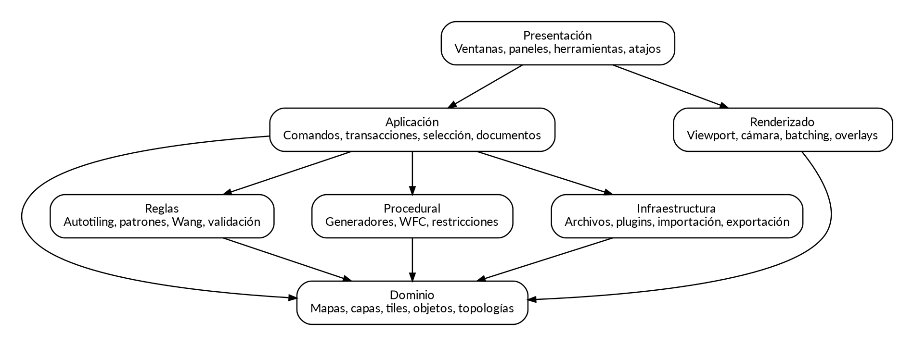

> **Documento:** PM-03  
> **Versión:** 0.1.1 - Auditoría incorporada
> **Estado:** Auditado; no aprobado para implementación, con correcciones previas a Fase 0.
> **Nombre del producto:** Proyecto Mosaico es un nombre provisional.


# Objetivos arquitectónicos

La arquitectura debe permitir probar algoritmos sin interfaz, cambiar el framework visual sin reescribir el dominio, añadir formatos sin contaminar el modelo interno y ejecutar operaciones largas de manera cancelable. También debe mantener una frontera clara entre datos autoritativos y cachés reconstruibles.



# Estilo general

Se propone una aplicación de escritorio modular con dominio rico, arquitectura por puertos y adaptadores y flujo de modificación basado en comandos. No se exige microservicios. La mayoría del producto funciona mejor como un proceso local con módulos internos y workers controlados.

## Capas

### Presentación

Ventanas, paneles, diálogos, accesibilidad, atajos, arrastrar y soltar y visualización de progreso. No debe contener reglas de serialización ni algoritmos de mapa.

### Aplicación

Casos de uso, comandos, transacciones, selección, documentos abiertos, jobs cancelables y coordinación entre servicios. Esta capa decide cuándo se modifica el documento.

### Dominio

Mapas, topologías, capas, celdas, objetos, propiedades, tilesets, identidad y invariantes. No depende del framework de UI, sistema operativo ni formato de archivo.

### Subsistemas especializados

Reglas, procedural, WFC y renderizado consumen contratos del dominio. Pueden tener estructuras optimizadas propias, pero no sustituyen al estado autoritativo.

### Infraestructura

Archivos, compresión, cachés, plugins, importadores, exportadores, logs, actualizaciones y adaptadores de motores.

# Regla de dependencias

Las dependencias apuntan hacia el dominio. Un importador conoce el formato externo y construye un documento interno. El dominio no conoce TMX, Unity ni el framework de ventanas.

Dependencias prohibidas:

- Dominio hacia UI.
- Dominio hacia importadores concretos.
- Generadores que escriben directamente en widgets.
- Plugins que acceden a campos internos no versionados.
- Renderer que modifica el documento durante el dibujo.

# Módulos propuestos

```text
Mosaico.Domain
Mosaico.Application
Mosaico.Editor
Mosaico.Rendering
Mosaico.Assets
Mosaico.Rules
Mosaico.Procedural
Mosaico.Wfc
Mosaico.Persistence
Mosaico.Formats.Native
Mosaico.Formats.Tiled
Mosaico.Export.Unity
Mosaico.Export.Godot
Mosaico.PluginApi
Mosaico.Cli
Mosaico.Diagnostics
```

Cada módulo público debe declarar propósito, dependencias permitidas, contratos estables y datos que posee.

# Documento y sesión

`ProjectDocument` representa datos persistentes. `EditorSession` contiene estado efímero: selección, herramienta activa, cámara, paneles, cachés y jobs. Guardar un proyecto no debe incluir posiciones de paneles salvo en un archivo de preferencias separado.

```csharp
public sealed class EditorSession
{
    public ProjectDocument Document { get; }
    public SelectionState Selection { get; }
    public CommandHistory History { get; }
    public JobRegistry Jobs { get; }
    public ViewportState Viewport { get; }
}
```

# Comandos y transacciones

Toda modificación autoritativa ocurre mediante un comando. Una pincelada comienza una transacción, acumula cambios y se confirma al soltar el puntero. Si la operación falla o se cancela, se revierte completa.

```csharp
public interface IEditorCommand
{
    string Description { get; }
    CommandResult Execute(DocumentContext context);
    void Undo(DocumentContext context);
}
```

Los comandos grandes no deben guardar una copia del proyecto. Conservan deltas por chunk, objetos afectados o estructuras persistentes con copy-on-write.

# Bus de eventos

Los eventos notifican cambios ya confirmados. No deben usarse para ocultar dependencias críticas. Ejemplos:

- `CellsChanged`
- `LayerStructureChanged`
- `TilesetReloaded`
- `ObjectChanged`
- `ProjectSaved`

Cada evento incluye región afectada y revisión. El renderer y los motores incrementales invalidan solo lo necesario.

# Jobs de larga duración

Importación, exportación, generación, WFC, validación global y construcción de thumbnails se ejecutan como jobs.

```csharp
public interface IBackgroundJob<T>
{
    Task<T> RunAsync(JobContext context, CancellationToken token);
}
```

Un job produce un resultado inmutable o un plan de cambios. La aplicación lo aplica en el hilo de documento dentro de una transacción. Esto evita que un worker modifique capas mientras la UI las lee.

# Servicios principales

- `DocumentService`: ciclo de vida, dirty state y guardado.
- `AssetService`: resolución, recarga y caché.
- `CommandService`: transacciones, undo y redo.
- `SelectionService`: selección multi-capa.
- `RuleEvaluationService`: coincidencia y salida incremental.
- `GenerationService`: ejecución de generadores.
- `ValidationService`: validadores y quick fixes.
- `ImportExportService`: adaptadores y reportes de pérdida.
- `PluginHost`: descubrimiento, permisos y aislamiento.
- `DiagnosticsService`: logs estructurados, métricas y bundles de soporte.

# Inyección de dependencias

La composición ocurre en el host de la aplicación. Los módulos de dominio aceptan interfaces pequeñas. Se evita un service locator global porque dificulta pruebas y plugins seguros.

# Estado autoritativo y derivados

Autoritativos:

- Documento, identificadores, propiedades y procedencia aceptada.
- Historial de migraciones.
- Paquetes de reglas incorporados al proyecto.

Derivados reconstruibles:

- Mallas de render.
- Miniaturas.
- Índices espaciales.
- Caché de coincidencias.
- Dominios WFC temporales.
- Previews procedurales no aceptados.

Los derivados nunca son la única copia de información del usuario.

# Concurrencia

El documento utiliza un modelo de escritor único. Lecturas pesadas trabajan sobre snapshots inmutables o revisiones. Al aplicar un resultado se comprueba que la revisión base no cambió; de lo contrario se reevalúa, fusiona explícitamente o solicita decisión.

# Manejo de errores

Los errores se clasifican en validación del usuario, incompatibilidad, fallo recuperable, fallo de integridad y fallo interno. Un fallo de integridad debe detener la operación, conservar evidencia y ofrecer recuperación, no continuar en estado dudoso.

# Estrategia tecnológica

Una opción razonable es C# con UI multiplataforma y un renderer 2D acelerado, por su ecosistema, tooling, integración con Unity y facilidad para bibliotecas de dominio. Rust con UI nativa o TypeScript con shell de escritorio también son viables, pero la decisión debe basarse en prototipos de viewport, input, HiDPI, packaging y perfilado.

El ADR inicial debe comparar al menos: tiempo de arranque, consumo, soporte de GPU, accesibilidad, automatización de UI, interoperabilidad nativa, depuración y estabilidad del framework.

# Calidad arquitectónica

Cada módulo debe tener pruebas de contrato. Se ejecutará una prueba de dependencias que impida referencias prohibidas. Los tipos persistentes no se exponen directamente a plugins; se usan DTO o interfaces versionadas.

# Decisiones abiertas

- Framework de UI y renderer.
- Uso de ECS para objetos: no recomendado en el editor salvo evidencia.
- Modelo de scripting de plugins: .NET, JavaScript, Lua o proceso externo.
- Persistencia del historial entre sesiones.
- Estrategia de aislamiento de plugins.


## Referencias técnicas de inspiración

Estas referencias se emplean para estudiar conceptos y formatos, no para copiar código, recursos gráficos ni interfaces:

- Tiled, documentación oficial: https://doc.mapeditor.org/
- Tiled, formato JSON: https://doc.mapeditor.org/en/stable/reference/json-map-format/
- Tiled, repositorio oficial: https://github.com/mapeditor/tiled
- TileKit, descripción oficial: https://rxi.itch.io/tilekit
- Unity 2D Tilemap y Rule Tile: https://docs.unity3d.com/6000.4/Documentation/Manual/tilemaps/tilemaps-landing.html
- Unity 2D Tilemap Extras: https://docs.unity3d.com/Packages/com.unity.2d.tilemap.extras@8.0/manual/RuleTile-introduction.html
- Wave Function Collapse, repositorio de referencia: https://github.com/mxgmn/WaveFunctionCollapse

Toda dependencia o reutilización de código deberá pasar por una revisión específica de licencia, atribución y compatibilidad con el modelo de distribución del producto.
