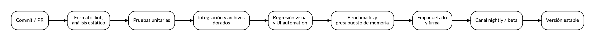

> **Documento:** PM-12  
> **Versión:** 0.2.0 - Ola 1 incorporada
> **Estado:** Aprobado
> **Alcance de aprobación:** Fase 0 condicionada; Fase 1 permanece no aprobada.
> **Nombre del producto:** Proyecto Mosaico es un nombre provisional.

# Filosofía

Un editor de contenido administra trabajo creativo valioso. La prioridad es no perderlo. La estrategia de calidad se organiza alrededor de integridad, previsibilidad, compatibilidad, rendimiento y experiencia.

# Pirámide de pruebas

## Unitarias

Topologías, transformaciones, chunks, propiedades, condiciones de reglas, serialización de tipos, seeds, bitsets y migraciones pequeñas.

## Property-based

Inversas de coordenadas, invariantes de vecinos, round-trip, máscaras, transformaciones de patrones, mapas generados dentro de límites y compatibilidad WFC.

## Integración

Carga/guardado, import/export, comandos, undo, jobs y plugins con host real.

## Archivos dorados

Proyectos pequeños canónicos y exportaciones esperadas. Se revisan cambios deliberadamente para no convertir snapshots en aprobación automática.

## Regresión visual

Escenas y estados de UI renderizados en plataformas de referencia. Se comparan con tolerancias apropiadas y revisión humana para cambios grandes.

## Automatización de interacción

Crear proyecto, importar tileset, pintar, deshacer, guardar, reabrir, generar y exportar. Se ejecuta en nightly y antes de release.

## Sesiones exploratorias

QA intenta flujos imprevisibles, entrada rápida, cancelaciones, archivos defectuosos y combinaciones no cubiertas.

# Matriz de riesgos

| Riesgo | Evidencia obligatoria |
|---|---|
| Pérdida de datos | Fault injection, atomicidad y recuperación |
| Geometría incorrecta | Property tests y escenas por topología |
| Undo divergente | Secuencias aleatorias de comandos |
| Reglas inconsistentes | Incremental igual a full recompute |
| WFC inválido | Validación exhaustiva de adyacencias |
| Regresión visual | Capturas doradas y UI automation |
| Plugin hostil | Límites, permisos y pruebas de aislamiento |
| Archivo bomba | Fuzzing, límites de descompresión y memoria |

# Integridad de documentos

Se ejecutan pruebas que matan el proceso en cada paso del guardado. Después se verifica que exista el archivo anterior válido o el nuevo completo, nunca una mezcla.

Undo/redo usa un oracle de estado: serialización canónica o hash estructural del documento. Después de undo debe coincidir con el estado previo.

# Fuzzing

Targets:

- Parsers JSON/binarios.
- Importadores externos.
- Descompresión de chunks.
- Polígonos y geometría.
- Catálogos WFC.
- Manifiestos de plugins.

Los crashes se minimizan y se incorporan como corpus permanente.

# Seguridad de archivos

- No ejecutar contenido al abrir proyecto.
- Rechazar rutas fuera del root salvo autorización.
- Limitar dimensiones de imágenes, recursión y conteos.
- Usar librerías de imagen actualizadas y sandbox cuando sea posible.
- Evitar carga automática de plugins incluidos en un proyecto no confiable.
- Mostrar origen y firma de paquetes.

# Seguridad de plugins

El host aplica permisos declarados. Operaciones de red, procesos y escritura fuera del proyecto requieren permisos separados cuando exista sandbox. Los plugins se pueden iniciar deshabilitados en modo seguro.

## Política F0-F1 de scripts y plugins

- Abrir un proyecto nunca ejecuta scripts, hooks, plugins ni instaladores.
- `Scripts[]` no forma parte del schema ejecutable v0; si una importación lo preserva, queda como dato inerte.
- El primer ejecutable no incluye host de plugins. Un plugin embebido nunca se carga automáticamente.
- Un plugin local de desarrollo futuro requerirá switch explícito y directorio externo confiable; in-process significa permisos completos del usuario, no sandbox.
- Firma demuestra procedencia, no aislamiento. Red, procesos, secretos y escritura externa permanecen prohibidos hasta ADR de aislamiento.
- Marketplace, actualización automática y plugins de terceros quedan fuera hasta Fase 7.

## Límites hostiles v0

Los valores son provisionales y solo pueden reducirse mediante configuración segura. Un archivo no confiable nunca aumenta hard caps.

| Recurso | Default | Hard cap | Diagnóstico |
|---|---:|---:|---|
| Archivo JSON | 64 MiB | 256 MiB | `RESOURCE_LIMIT_FILE_BYTES` |
| Profundidad JSON | 64 | 128 | `RESOURCE_LIMIT_DEPTH` |
| String | 1 MiB | 8 MiB | `RESOURCE_LIMIT_STRING` |
| Elementos por array | 1.000.000 | 4.000.000 | `RESOURCE_LIMIT_COUNT` |
| Imagen por lado | 8.192 px | 16.384 px | `RESOURCE_LIMIT_IMAGE_DIMENSION` |
| Imagen decodificada | 256 MiB | 512 MiB | `RESOURCE_LIMIT_MEMORY` |
| Descompresión total | 1 GiB | 4 GiB | `RESOURCE_LIMIT_EXPANDED_BYTES` |
| Ratio de descompresión | 50× | 100× | `RESOURCE_LIMIT_COMPRESSION_RATIO` |
| Capas | 1.024 | 4.096 | `RESOURCE_LIMIT_LAYERS` |
| Objetos | 1.000.000 | 4.000.000 | `RESOURCE_LIMIT_OBJECTS` |
| Manifiesto de plugin | 1 MiB | 4 MiB | `RESOURCE_LIMIT_MANIFEST` |
| Parse/importación | 10 s | 30 s | `RESOURCE_LIMIT_TIME` |
| Memoria por importación | 512 MiB | 1 GiB | `RESOURCE_LIMIT_MEMORY` |

Todo rechazo informa recurso, observado, límite y acción. La cancelación deja documento y destino intactos. Paths se validan sobre destino final contra `..`, absolutas, UNC, device paths, ADS, symlinks/junctions y carreras TOCTOU.

# Actualizaciones

- Canal estable, beta y nightly.
- Paquetes firmados.
- Verificación de integridad.
- Rollback disponible.
- No migrar irreversiblemente un proyecto sin backup.
- Notas de release con cambios de formato y plugins.

# Privacidad

Telemetría desactivable y mínima. No se envían mapas, nombres de recursos ni paths completos. Los crash reports requieren revisión o redacción. La política debe ser legible desde la aplicación.

# Observabilidad

Logs estructurados con correlation ID por job. Niveles: información, warning, error e integridad. El modo normal evita ruido; el bundle de soporte incluye versión, plataforma, plugins, configuración de renderer y stack traces.

# Puertas de pull request

- Compilación en plataformas soportadas.
- Formato y análisis estático.
- Unit y property tests.
- Arquitectura y dependencias.
- Pruebas del módulo afectado.
- Migraciones y documentación cuando aplique.

# Puertas de release

- Suite completa verde.
- Corpus de importación/exportación.
- Regresión visual revisada.
- Benchmarks dentro de presupuesto o waiver explícito.
- Prueba de instalación, actualización y rollback.
- Verificación de firmas.
- Sesión exploratoria de integridad.
- Documentación y ejemplos actualizados.

# Gate ejecutable por fase

Desde Fase 1 cada checkpoint exige checkout limpio, build reproducible, binario identificado por commit, comando de arranque, fixture versionado, suite verde, walkthrough manual, caso de error/recuperación, benchmark, evidencia de entorno, accesibilidad por teclado/escala y revisión humana. Evidencia de otro commit invalida el gate. S0/S1 mantiene fase abierta; S2 requiere waiver con dueño y caducidad.

| Fase | Escenario manual mínimo |
|---|---|
| 1 | TR-01: crear, pintar, borrar/fill, undo/redo, guardar, reabrir y exportar CSV/PNG |
| 2 | Objetos/propiedades y autosave; matar proceso, recuperar y consumir exportación en motor propio |
| 3 | TR-02: cambio semántico incremental igual a full, explicable y reversible |
| 4 | Crear/editar/exportar isométrico y hex; picking y seis vecinos correctos |
| 5 | TR-03: preview, cancelación, regiones bloqueadas, reproducibilidad y reparación |
| 6 | Completar fixture WFC sin adyacencias inválidas; contradicción explica causa y acción |
| 7 | Importar/exportar corpus Tiled; aceptar plugin compatible y rechazar incompatible con diagnóstico |

El primer spike F0 usa una versión reducida de MG-01 limitada a viewport ortogonal, pincel/borrador, undo/redo y round-trip. No cuenta como gate completo de Fase 1.

# Severidad de bugs

- **S0:** pérdida o corrupción de datos; bloquea todo release.
- **S1:** crash frecuente, exportación incorrecta o incompatibilidad grave.
- **S2:** función importante defectuosa con workaround.
- **S3:** problema menor o visual.

Un S0 requiere análisis de causa, prueba de regresión y revisión de componentes similares.

# Matriz de plataformas

Debe declararse explícitamente qué combinaciones de sistema, arquitectura, GPU y escala de pantalla se soportan. No se acepta "multiplataforma" como criterio sin instaladores y pruebas reales.

# Beta

La beta incluye formato con política de migración, canal de feedback, proyectos de ejemplo y mecanismo sencillo de adjuntar bundle. Se recomienda limitar plugins de terceros hasta estabilizar API.

# Definición de terminado

Una historia termina cuando código, pruebas, diagnóstico, documentación de usuario, accesibilidad y medición de rendimiento están resueltos en proporción al riesgo.

## Referencias técnicas de inspiración

Estas referencias se emplean para estudiar conceptos y formatos, no para copiar código, recursos gráficos ni interfaces:

- Tiled, documentación oficial: https://doc.mapeditor.org/
- Tiled, formato JSON: https://doc.mapeditor.org/en/stable/reference/json-map-format/
- Tiled, repositorio oficial: https://github.com/mapeditor/tiled
- TileKit, descripción oficial: https://rxi.itch.io/tilekit
- Unity 2D Tilemap y Rule Tile: https://docs.unity3d.com/6000.4/Documentation/Manual/tilemaps/tilemaps-landing.html
- Unity 2D Tilemap Extras: https://docs.unity3d.com/Packages/com.unity.2d.tilemap.extras@8.0/manual/RuleTile-introduction.html
- Wave Function Collapse, repositorio de referencia: https://github.com/mxgmn/WaveFunctionCollapse

Toda dependencia o reutilización de código deberá pasar por una revisión específica de licencia, atribución y compatibilidad con el modelo de distribución del producto.
